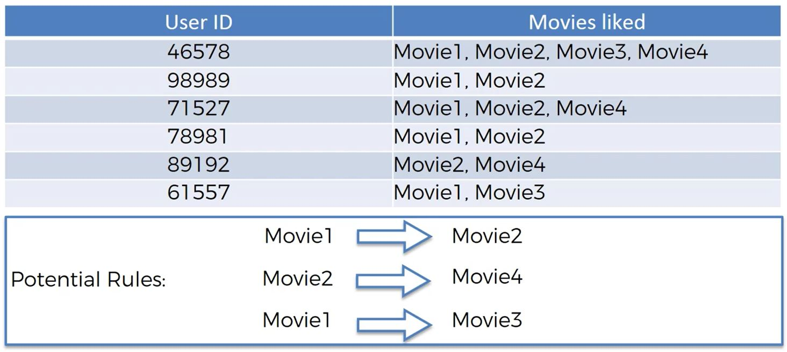
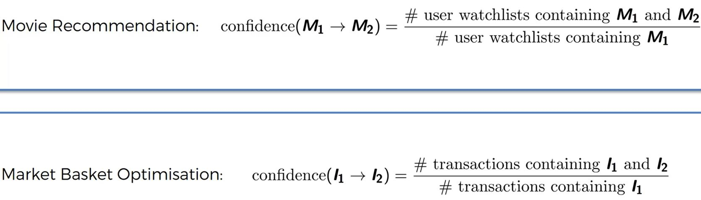
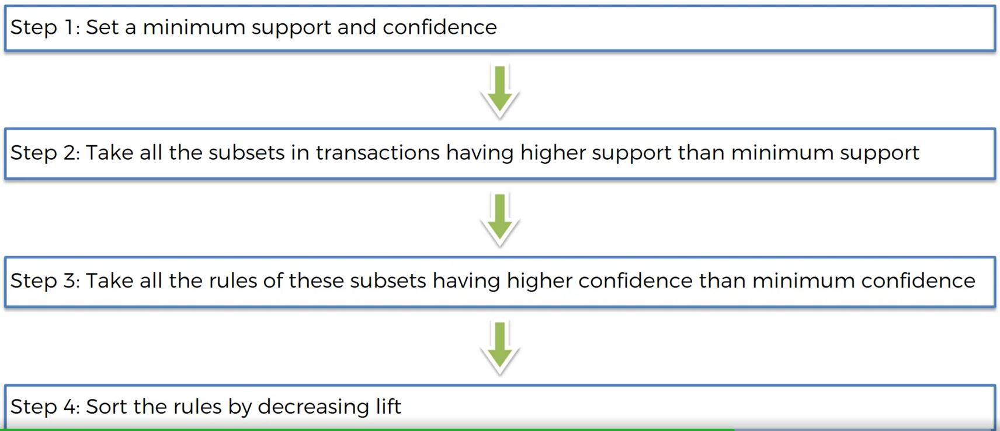

```{r echo=FALSE, warning=FALSE, message=FALSE}
if(!require(easypackages)){install.packages("easypackages")}
library(easypackages)
packages("arules", prompt = FALSE)
```

Pretty simple concept. . . .people that buy also buy. . . . .

```{r, out.width = "600px", echo=FALSE}

```

Apriori Algorithm consists of 3 parts:

> apriori - previous knowledge

- Support:  number of people that picked something / all users
- Confidence:  number of x and y / x

```{r, out.width = "600px", echo=FALSE}

```

- Lift:  confidence / support

Process:

```{r, out.width = "600px", echo=FALSE}

```

> Apriori is a basic example - recommendation engines are more sophisticated

```{r}
# Data Preprocessing
#We execute the read.csv onlt to see the data.  Not needed for read.transactions
dataset = read.csv('../data/Market_Basket_Optimisation.csv', header = FALSE)
head(dataset)
#Now make a sparse matrix - each product will have its own column
dataset = read.transactions('../data/Market_Basket_Optimisation.csv', sep = ',', rm.duplicates = TRUE)
#Line above returns some informnation.  Interpret as 5 transactions with 1 duplicate
summary(dataset)
itemFrequencyPlot(dataset, topN = 10)

# Training Apriori on the dataset
# support and confidence are based on specific circumstances - no rules to follow
# We are going to evalaute the products that are purchased 3 times/day only (iterative process).  The dataset contains a weeks worth of purchase data.  Therefore support = (3x7)/7500
# Confidence depnds on business rules.  Start with default then iterate (.8 is very high)
rules = apriori(data = dataset, parameter = list(support = 0.003, confidence = 0.8))
# 0 rules are produced by the code above.  Confidence is too high.  Being right 80% of the time!
rules = apriori(data = dataset, parameter = list(support = 0.003, confidence = 0.4))
#Now 281 rules!

# Visualizing the results
inspect(sort(rules, by = 'lift')[1:10])
```

Some problems are suggested in the output.  Example:  [6] chocolate, herb & pepper suggests ground beef.  Recall chocolate is one of the most purchased items so it shows up in baskets but does this make sense?  This might suggest that the confidence it still too high.  (We do not want to change the business rules that drive the support parameter.)  Same potential problem with mineral water.

```{r}
rules = apriori(data = dataset, parameter = list(support = 0.003, confidence = 0.2))
inspect(sort(rules, by = 'lift')[1:10])
```

Many more rules as expected - 1348.  The rules appear to make more sense - most of them.  Does cereal and spaghetti suggest ground beef with a 46% confidence?

Could try changing support.  What happens if we change to products that 4 times/day? (support = (4 x 7)/7500 = 0.00373)

```{r}
rules = apriori(data = dataset, parameter = list(support = 0.004, confidence = 0.2))
inspect(sort(rules, by = 'lift')[1:10])
```

811 rules now because of the increased support.  Rules look valid.  Now business owner could rearrange product placements to improve sales.


