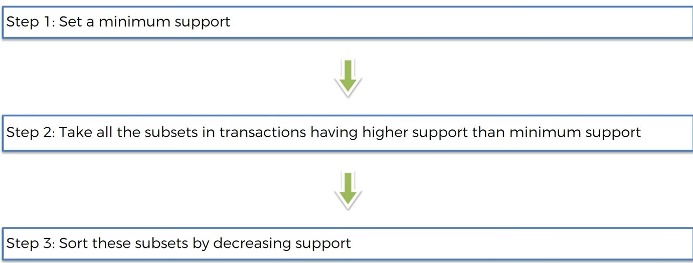

```{r echo=FALSE, warning=FALSE, message=FALSE}
if(!require(easypackages)){install.packages("easypackages")}
library(easypackages)
packages("arules", prompt = FALSE)
```

Eclat is a simplified version of Association Rules Learning.  Eclat talks about sets, not rules.

Eclat only has support:

- Support:  number of people that picked something / all users where at least two items are in the numerator.  (One value would just provide the frequency of that one item.)

```{r, out.width = "600px", echo=FALSE}

```

Eclat provides simple results consisting on items frequently bought together.

```{r}
# Data Preprocessing
dataset = read.csv('../data/Market_Basket_Optimisation.csv')
dataset = read.transactions('../data/Market_Basket_Optimisation.csv', sep = ',', rm.duplicates = TRUE)
summary(dataset)
itemFrequencyPlot(dataset, topN = 10)

# Training Eclat on the dataset.  Note: No confidence parameter.  Using the minlen too.
# A setr of 1 item is meaningless.
rules = eclat(data = dataset, parameter = list(support = 0.003, minlen = 2))

# Visualising the results.  Note:  No lift parameter.
inspect(sort(rules, by = 'support')[1:10])
```
845 Sets are returned.  The results are biased by the most popular items.  Not as helpful as Apriori.

