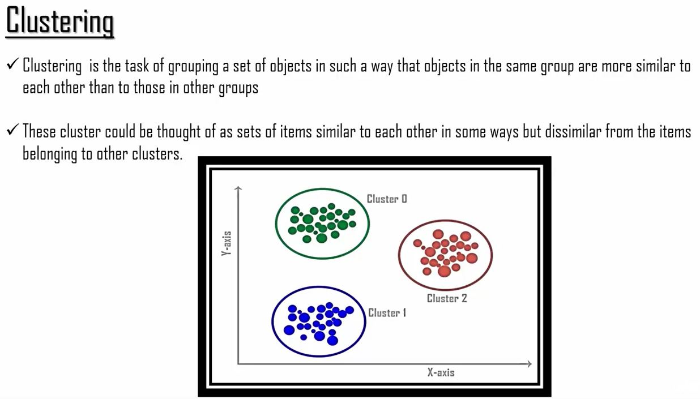
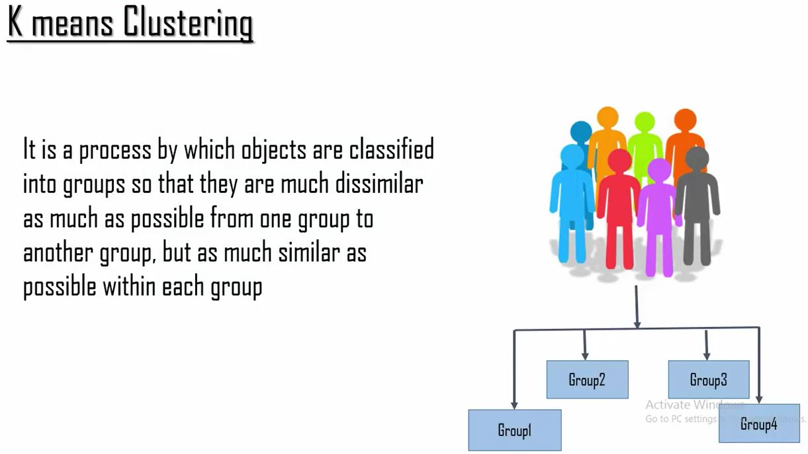
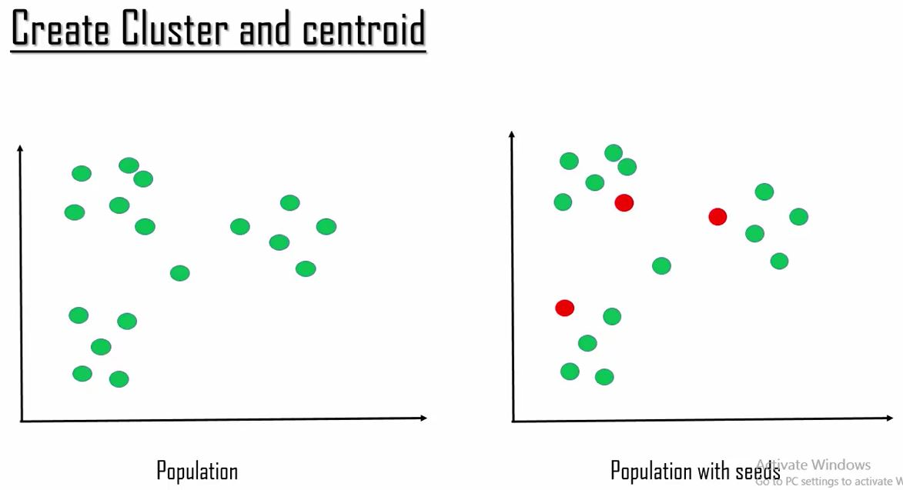
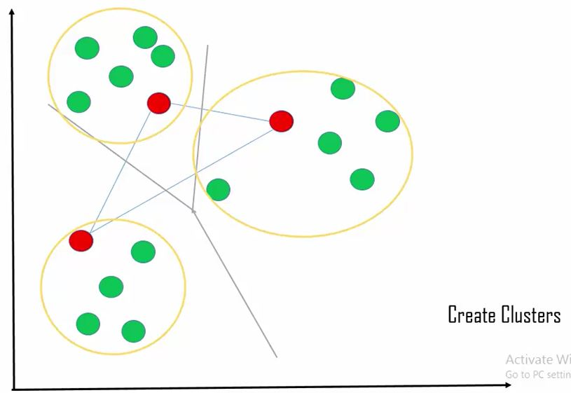
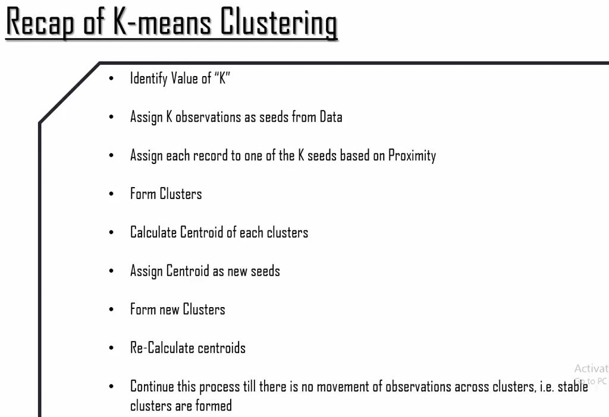
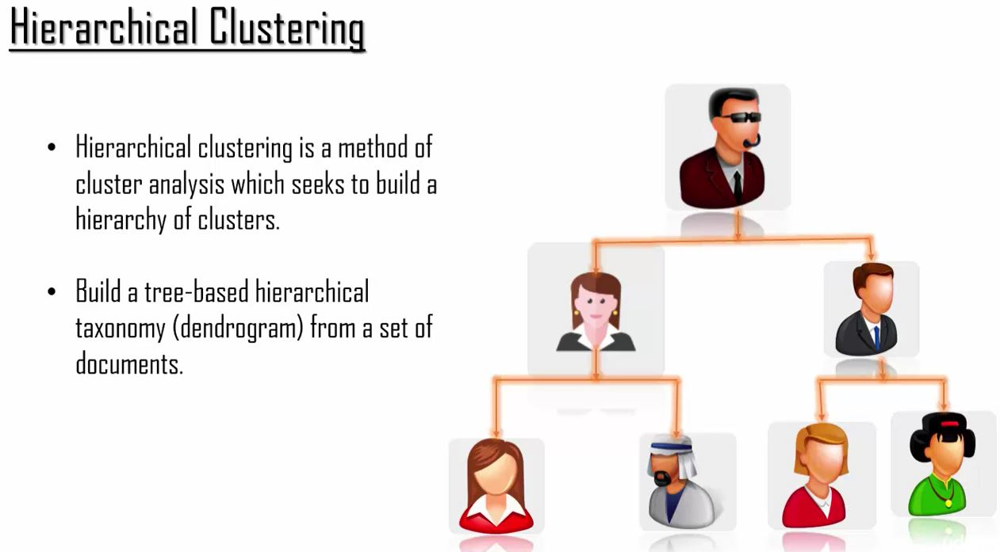
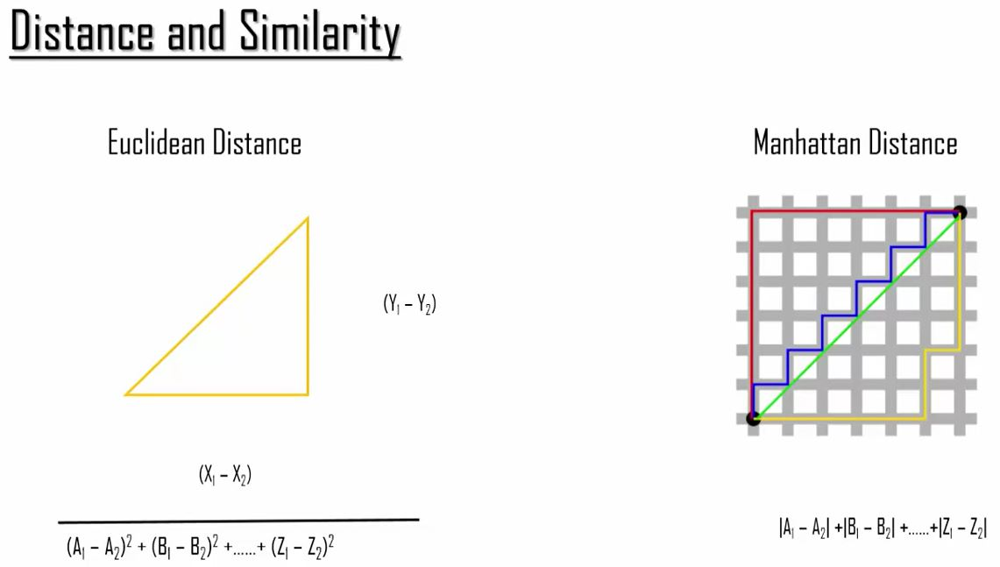

```{r echo=FALSE, warning=FALSE, message=FALSE}
if(!require(easypackages)){install.packages("easypackages")}
library(easypackages)
packages("caret", "ggplot2", "dplyr", prompt = FALSE)#kernlab needed for spam data
```

## Introduction

```{r out.width = "500px", echo=FALSE}

```

Two primary types of unsupervised clustering:

- K-Means
- Hierarchical

## K-Means Clustering

- most widely used clusrting method
- The k stands for the number of clsuters the algorithm will attempt to identify

```{r out.width = "500px", echo=FALSE}







```

### K-Means R Code

```{r}
glimpse(iris)
inTrain <- createDataPartition(y=iris$Species, p=0.7, list=FALSE)
training <- iris[inTrain,]
testing <- iris[-inTrain,]

# Cluster with k-Means
KMeans1 <- kmeans(subset(training, select=-c(Species)), centers=3)
KMeans1
training$clusters <- as.factor(KMeans1$cluster)
qplot(Petal.Width, Petal.Length, color=clusters, data=training)

# Compare to real labels
table(KMeans1$cluster, training$Species)

# Build predictor
modFit <- train(clusters~., data=subset(training, select=-c(Species)), method="rpart")

# Apply on test
testClusterPred <- predict(modFit, testing)
table(testClusterPred, testing$Species)
```

## Hierarchical Clustering

```{r out.width = "500px", echo=FALSE}


#Popular Distance Measurement Methods
#Euclidean is used when data is continuous.
#Manhattan distrance is used for binary data

```

### Hierarchical Clustering R Code

```{r}
# Sample dataset
sampleiris <- iris[sample(1:150, 40),]
# Calculate distance
H.distance <- dist(sampleiris[,-5], method="euclidean")
# perform Hierarchical clustering
H.fit <- hclust(H.distance, method="average")
 
# plot  dendograph
plot(H.fit, hang=-1, label=sampleiris$Species)# hang is used to put the labels of the leaf in same level
groups <- cutree(H.fit, k=3) # cut tree into 3 clusters
rect.hclust(H.fit, k=3, border="red") 
```

