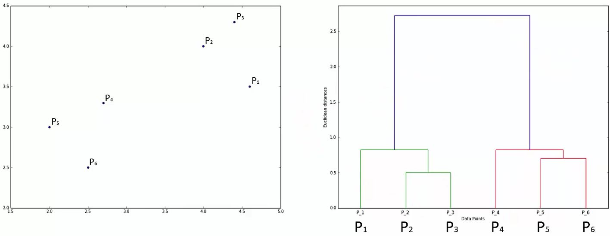

Very similar results often with Hierarchical Clustering as in k-Means.  The way you get to the results is different.

There are two types:

- Agglomerative (we will focus on this)
- Divisive

#### Agglomerative

```{r out.width = "700px", echo=FALSE}

```

> Note we are talking about the proximity of clusters, not points. This is a crucial element to consider in your approach.

There are different ways to measure cluster distances (distances between centroids is shown):

```{r out.width = "400px", echo=FALSE}

```

Lets understand this through an example:

```{r out.width = "400px", echo=FALSE}


```

The algo remembers how we got to one cluster. This is what a dendogram illustrates.

#### How Dendograms Work

```{r out.width = "800px", echo=FALSE}

```

Note:  The height of the horizontal lines represent the size of the Euclidean distance between points.  Example:  P_2 and P_3 have the lowest height illustrating that those two points are the closest together compared to all other points.

```{r out.width = "800px", echo=FALSE}

```

The plot above shows we are evaluating 2 clusters (how many times the horizontal line crosses the dendogram.)  The breakpoint appears to be ~ 1.75.

```{r out.width = "800px", echo=FALSE}

```

This one has 4 clusters.

The highest vertical distance in a dendogram that does not cross any extended horizontal lines suggests the optimal number of clusters.

```{r out.width = "800px", echo=FALSE}

```

> Above, it is not critical where the 2 Clusters horizonatl line is placed becase it will only include 2 clusters.  As shown, it appears to cross the Euclidean distance (Y value) at 1.75 but it could also cross at 1.0 or 2.5.

Here is another example:

```{r out.width = "800px", echo=FALSE}

```

```{r hierarchialClustering, warning=FALSE, message=FALSE}
# Importing the dataset
dataset = read.csv("../data/Mall_Customers.csv")
dataset = dataset[4:5]

# Using the dendrogram to find the optimal number of clusters
dendrogram = hclust(d = dist(dataset, method = 'euclidean'), method = 'ward.D')#ward.D minimizes that variance in each cluster
plot(dendrogram, main = paste('Dendrogram'), xlab = 'Customers', ylab = 'Euclidean distances')

# Fitting Hierarchical Clustering to the dataset
y_hc = cutree(dendrogram, 5)
#Cuts a tree, e.g., as resulting from hclust, into several groups either by specifying the desired number(s) 
#of groups or the cut height(s).

# Visualising the clusters - this only works for 2 dimensions
library(cluster)
clusplot(dataset, y_hc, lines = 0, shade = TRUE, color = TRUE, labels= 2, plotchar = FALSE, span = TRUE,
         main = paste('Clusters of customers'), xlab = 'Annual Income', ylab = 'Spending Score')
```
