```{r echo=FALSE, message=FALSE, warning=FALSE}
if(!require(easypackages)){install.packages("easypackages")}
library(easypackages)
packages("dplyr", "tidyr", "cluster", prompt = FALSE)
```

### Introduction to k-Means

```{r out.width = "500px", echo=FALSE}
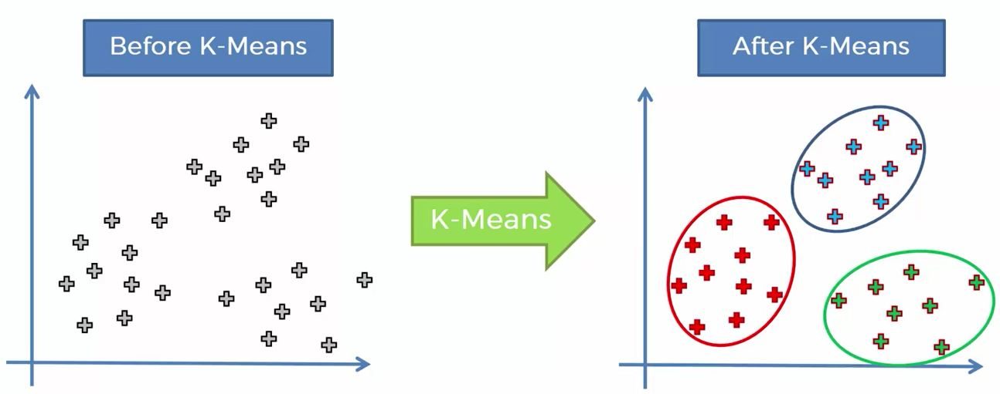
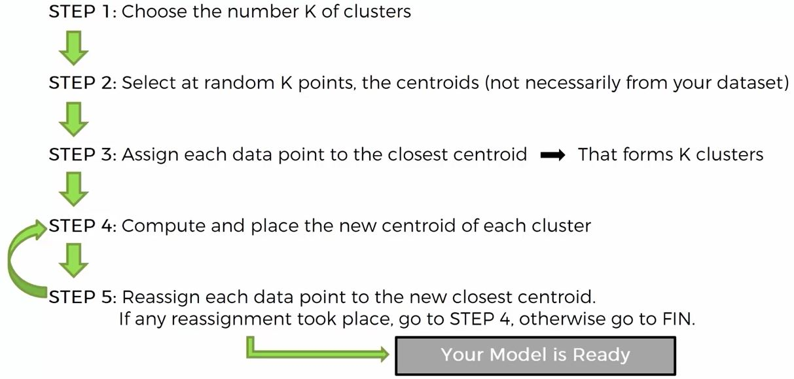
```

Lets work through an example to understand how this works:

```{r out.width = "400px", echo=FALSE}
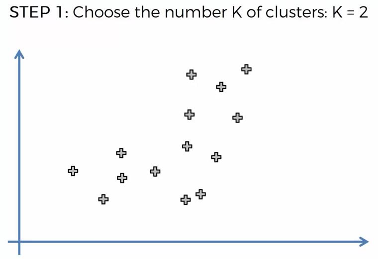
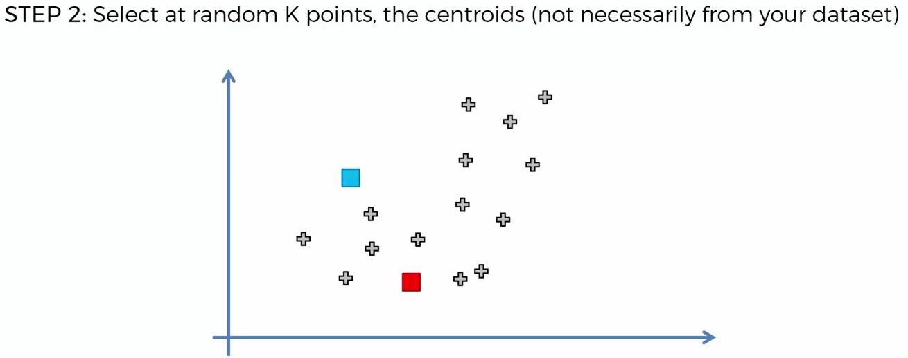
knitr::include_graphics("../images/kMeans5.JPG")
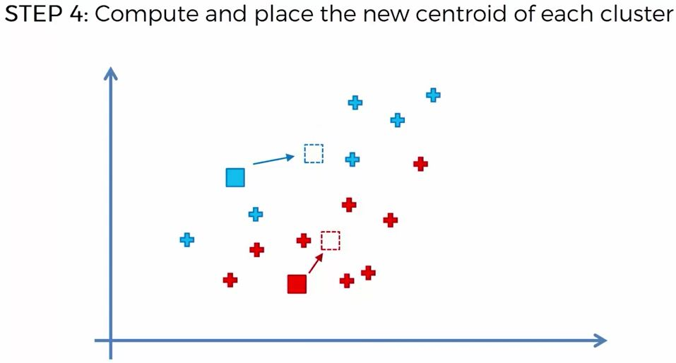
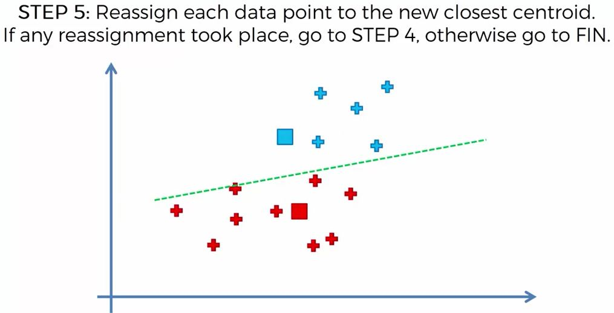
```

The last step iterates until the model cannot be improved  It might look like this:

```{r out.width = "400px", echo=FALSE}
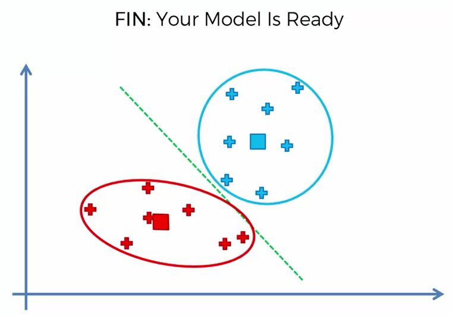
```

### Random Initialization Trap

If the initial centroids are way off, problematic problems might arise.

This is the intuitive result:

```{r out.width = "400px", echo=FALSE}
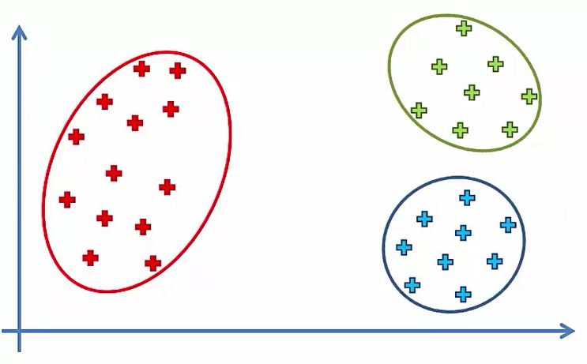
```

But if the initial centroids are picked poorly, different results might occur:

```{r out.width = "400px", echo=FALSE}
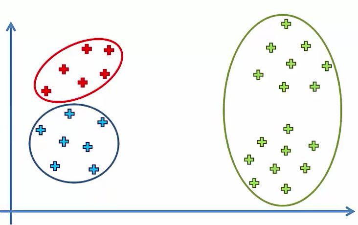
```

There is an addition to the k-Means algorithm that avoids this problem:  K-Means++.  This happens in the background so it is easy to avoid.

### Choosing k

WCSS - Within Clusters Sum of Squares.  Useful to compare the goodness of fit of two K-Means clusterings.  Lets look at an example:

```{r out.width = "400px", echo=FALSE}
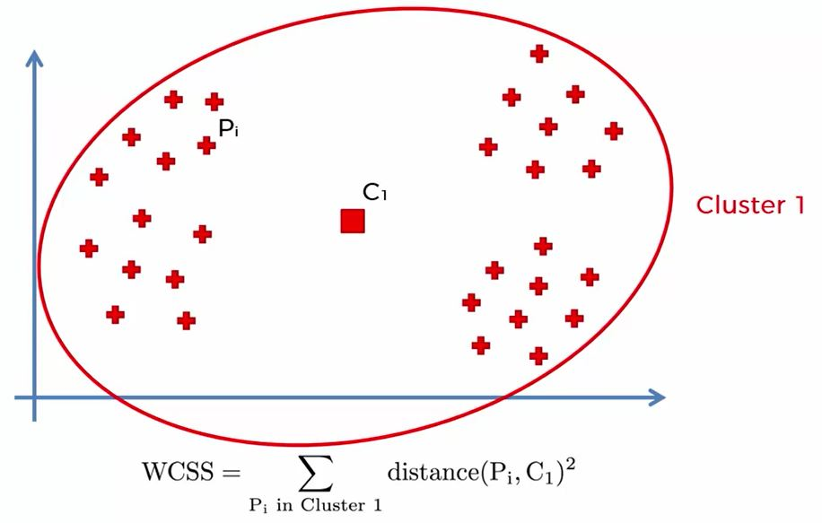
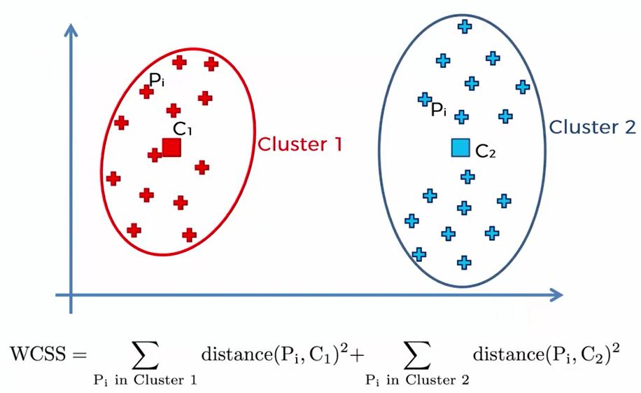
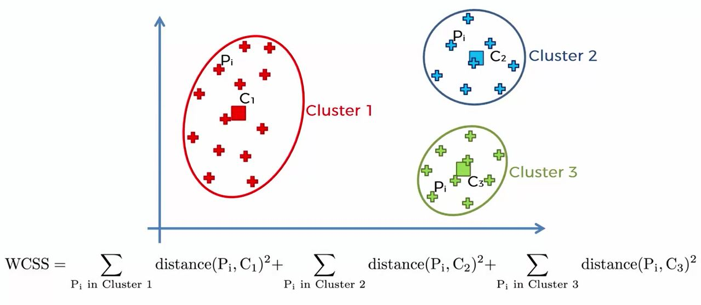
```

You can have as many clusters as there are points.  WCSS = 0 when each point is a centroid.  It constantly decreases.  However, diminishing returns suggest the optimal k value (called the Elbow Method):

```{r out.width = "400px", echo=FALSE}
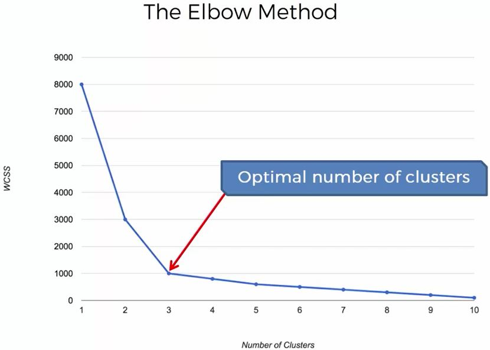
```

The elbow is not always so obvious.  Use your judgement.

```{r kMeans, warning=FALSE, message=FALSE}
# Importing the dataset
dataset = read.csv("../data/Mall_Customers.csv")
dataset = dataset[4:5]

# Using the elbow method to find the optimal number of clusters
set.seed(6)
wcss = vector()
for (i in 1:10) wcss[i] = sum(kmeans(dataset, i)$withinss)
plot(1:10, wcss, type = 'b', main = paste('The Elbow Method'), xlab = 'Number of clusters', ylab = 'WCSS')

# Fitting K-Means to the dataset
set.seed(29)
kmeans = kmeans(x = dataset, centers = 5)
y_kmeans = kmeans$cluster

# Visualizing the clusters
clusplot(dataset, y_kmeans, lines = 0, shade = TRUE, color = TRUE, labels = 2, plotchar = FALSE,
         span = TRUE, main = paste('Clusters of customers'), xlab = 'Annual Income', ylab = 'Spending Score')
```
