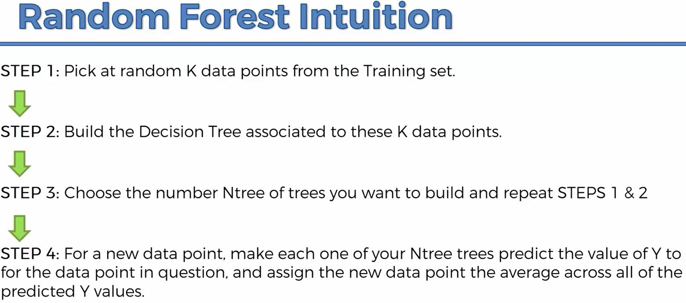

```{r, out.width = "800px", echo=FALSE}

```

```{r randomForestRegression, message=FALSE, warning=FALSE}
# Importing the dataset
dataset = read.csv("../../data/Position_Salaries.csv")
dataset = dataset[2:3]

# Splitting the dataset into the Training set and Test set
# Not needed

# Feature Scaling Not needed
# training_set = scale(training_set)
# test_set = scale(test_set)

# Fitting Random Forest Regression to the dataset
# install.packages('randomForest')
library(randomForest)
set.seed(1234)
regressor = randomForest(x = dataset[-2], y = dataset$Salary, ntree = 500)

# Predicting a new result with Random Forest Regression
y_pred = predict(regressor, data.frame(Level = 6.5))

# Visualising the Random Forest Regression results (higher resolution)
library(ggplot2)
x_grid = seq(min(dataset$Level), max(dataset$Level), 0.01)
ggplot() + geom_point(aes(x = dataset$Level, y = dataset$Salary), colour = 'red') +
  geom_line(aes(x = x_grid, y = predict(regressor, newdata = data.frame(Level = x_grid))), colour = 'blue') +
  ggtitle('Truth or Bluff (Random Forest Regression)') + xlab('Level') + ylab('Salary')
```