```{r echo=FALSE, warning=FALSE, message=FALSE}
if(!require(easypackages)){install.packages("easypackages")}
library(easypackages)
packages("caret", "rpart",  "rattle", "rpart.plot", "adabag", "ElemStatLearn", 
         "dplyr", "party", "ISLR", "ggplot2", prompt = FALSE)
```

## Decision Tree Introduction

```{r out.width = "500px", echo=FALSE}
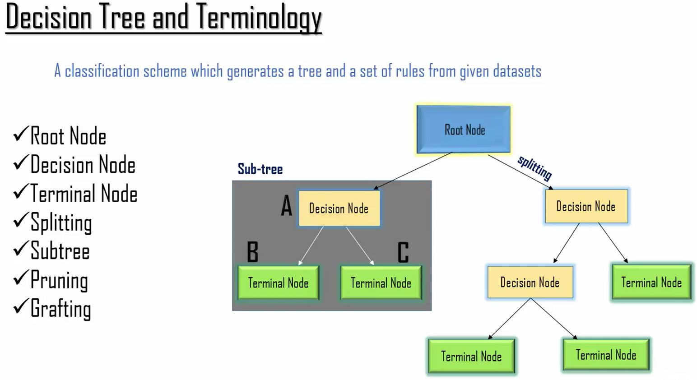

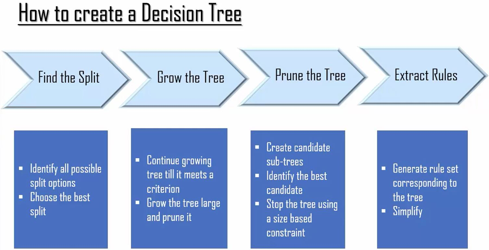

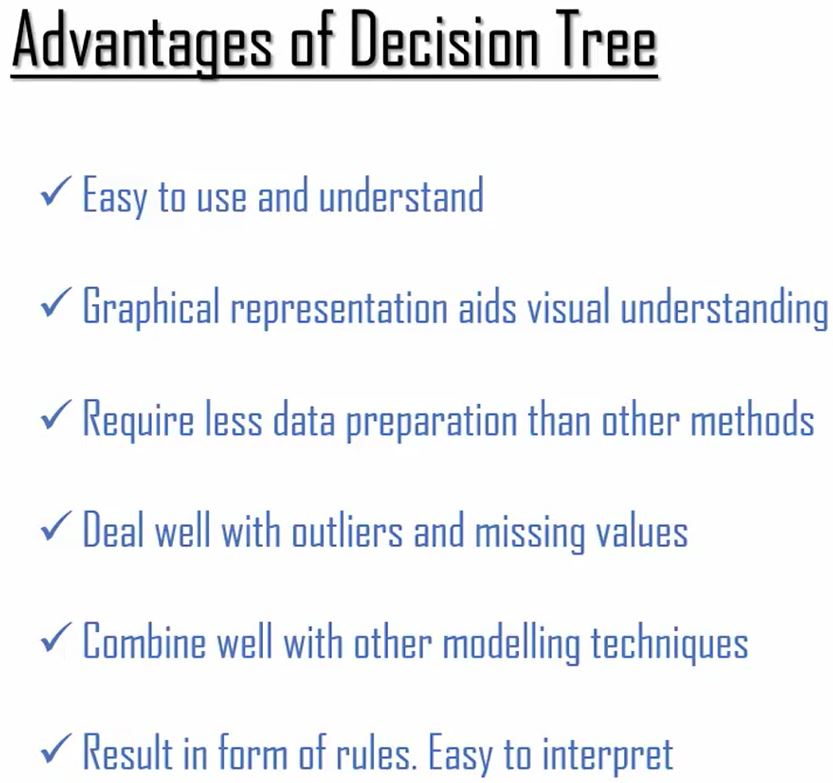

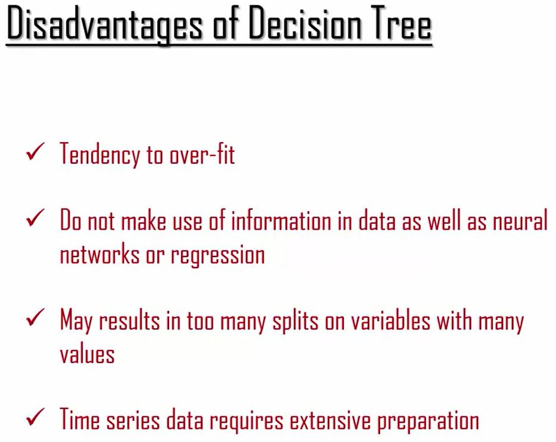
```

## Decision Tree Code

```{r}
glimpse(iris)
names(iris)
table(iris$Species)

### Create training and testing Dataset
inTrain <-createDataPartition(y=iris$Species, p=0.7, list=FALSE)
training <-iris[inTrain,]
testing<-iris[-inTrain,]

modFit<-train(Species~., method = "rpart", data=training)
print(modFit$finalModel)

fancyRpartPlot(modFit$finalModel)

# predict new values
prediction<-predict(modFit, newdata=testing)
# summarize accuracy
table(prediction, testing$Species)
```

## Bagging

Bagging or bootstrap aggregation is a simple method to take samples from your test data set to improve the model.  The predictions are avergaged to give a better performing model.

```{r}
glimpse(ozone)
predictors =  data.frame(ozone=ozone$ozone)
temperature  = ozone$temperature
treebag <- bag(predictors, temperature, B=10, bagControl=bagControl(fit=ctreeBag$fit,
             predict = ctreeBag$pred, aggregate = ctreeBag$aggregate))

plot(ozone$ozone,temperature,col="green",pch=19)
points(ozone$ozone,predict(treebag$fits[[1]]$fit,predictors),pch=19,col="red")
points(ozone$ozone,predict(treebag,predictors),pch=19,col="blue")
```

## Boosting

One of the most accurate out-of-the-box classifiers.  

Start with some data:

```{r out.width = "500px", echo=FALSE}
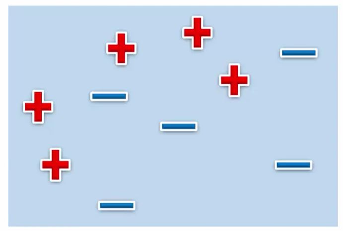
```

Then begin to separate the data to minimize the error:

```{r}
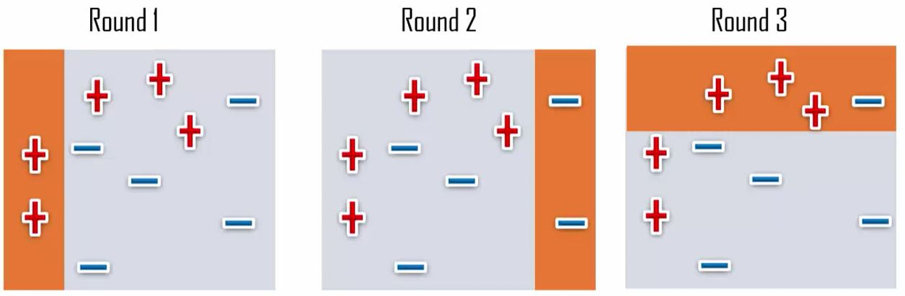
```

Until you get something like this:

```{r}
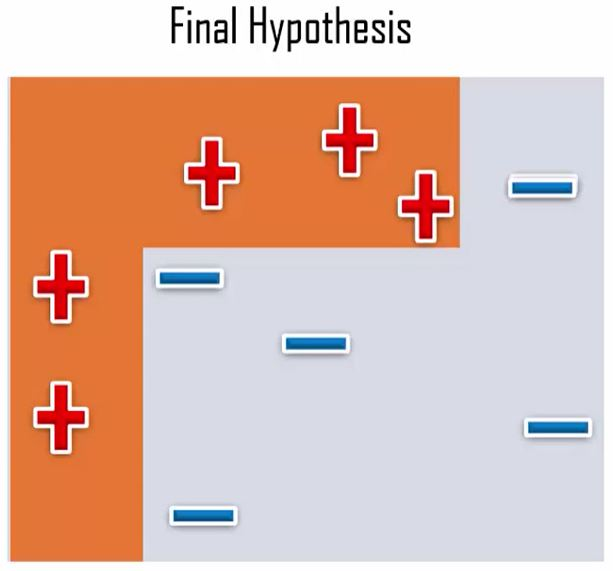
```

```{r message=FALSE}
data(Wage)
glimpse(Wage)
Wage <- subset(Wage, select=-c(logwage))
inTrain <- createDataPartition(y = Wage$wage, p=0.7, list=FALSE)
training <- Wage[inTrain,]
testing <- Wage[-inTrain,]

# Fit a model
modFit<-train(wage~., method="gbm", data=training, verbose=FALSE)#GBM- Generalized Boosted Models for multiclass classification
print(modFit)

# plot the result
qplot(predict(modFit,testing), wage,data=testing)
```

## Random Forest

```{r}
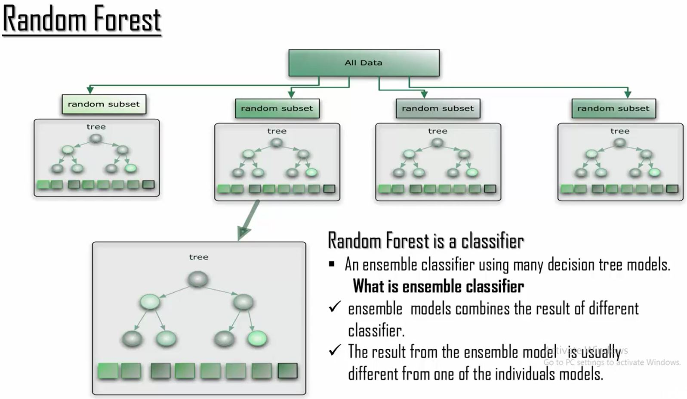

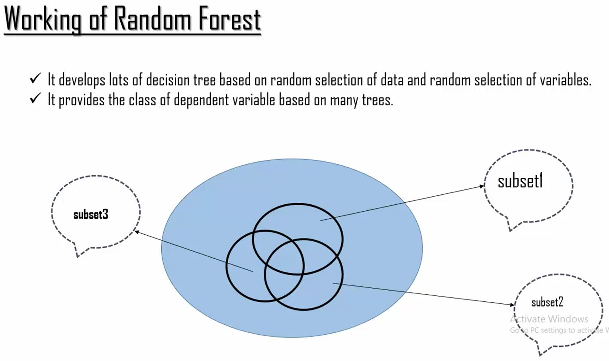

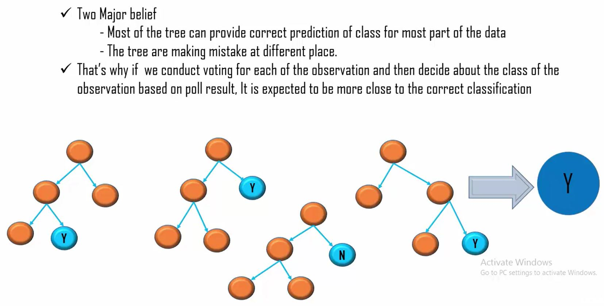
                        
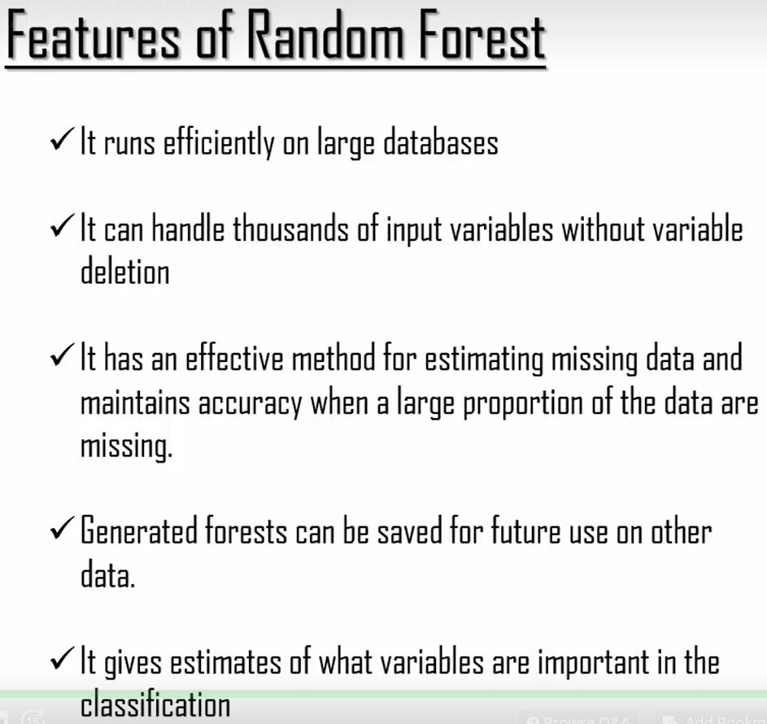                        
```

```{r}
glimpse(iris)
table(iris$Species)

### Create training and testing Dataset
inTrain <- createDataPartition(y=iris$Species, p=0.7, list=FALSE)
training <- iris[inTrain,]
testing <- iris[-inTrain,]

modFit<-train(Species~., method = "rf", data=training, prox=TRUE)
#Uncertain what prox does:  the proximity (or similarity) matrix, assumed to be symmetric with 1 on the diagonalandin[0,1]offthediagonal(theorderofrow/columnmustmatchthat of x)
modFit

# get a single Tree
getTree(modFit$finalModel, labelVar = TRUE)
#A split value less than the split point value goes to the left.

# Predicting new values
pred <- predict(modFit, testing)
testing$predRight <- pred==testing$Species
table(pred, testing$Species)

# plot predict values
qplot(Petal.Width, Petal.Length, color = predRight, data = testing, main = "New data Prediction")
```

