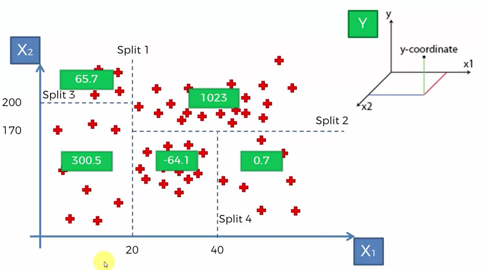

```{r, out.width = "400px", echo=FALSE}


```

> Remember, descision tress are non-continuous and non-linear.

```{r decsionTreeRegression, message=FALSE, warning=FALSE}
# Importing the dataset
dataset = read.csv("../data/Position_Salaries.csv")
dataset = dataset[2:3]

# Splitting the dataset into the Training set and Test set
#Do not have enough data to split - use it all

# Feature Scaling - Do not need to scale because not based on Euclidean distances
# training_set = scale(training_set)
# test_set = scale(test_set)

# Fitting Decision Tree Regression to the dataset
# install.packages('rpart')
library(rpart)
regressor1 = rpart(formula = Salary ~ ., data = dataset)
# See what happens with minsplit below.
regressor2 = rpart(formula = Salary ~ ., data = dataset, control = rpart.control(minsplit = 1))

# Predicting a new result with Decision Tree Regression
y_pred = predict(regressor2, data.frame(Level = 6.5))

# Visualising the Decision Tree Regression results (higher resolution)
# This only works in 2D
library(ggplot2)
x_grid = seq(min(dataset$Level), max(dataset$Level), 0.01)
ggplot() + geom_point(aes(x = dataset$Level, y = dataset$Salary), colour = 'red') +
  geom_line(aes(x = x_grid, y = predict(regressor1, newdata = data.frame(Level = x_grid))), colour = 'blue') +
  ggtitle('Decision Tree Regression - without minsplit') + xlab('Level') + ylab('Salary')
  
ggplot() + geom_point(aes(x = dataset$Level, y = dataset$Salary), colour = 'red') +
  geom_line(aes(x = x_grid, y = predict(regressor2, newdata = data.frame(Level = x_grid))), colour = 'blue') +
  ggtitle('Decision Tree Regression - with minsplit') + xlab('Level') + ylab('Salary')
```

> minsplit:  the minimum number of observations that must exist in a node in order for a split to be attempted.

```{r}
# Plotting the tree
plot(regressor2)
text(regressor2)
```

