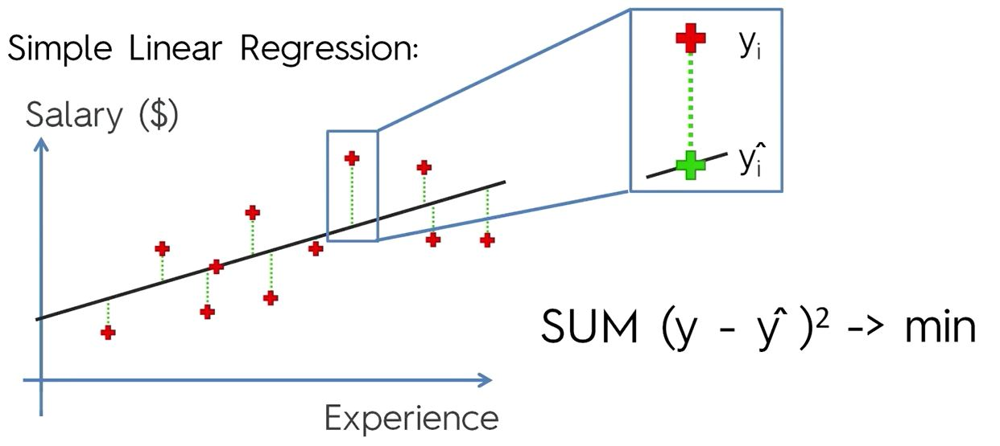
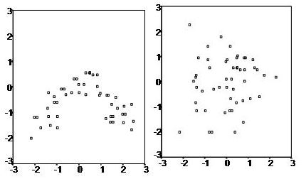
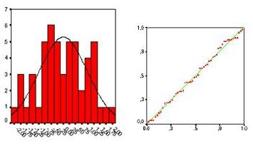
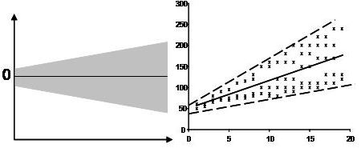
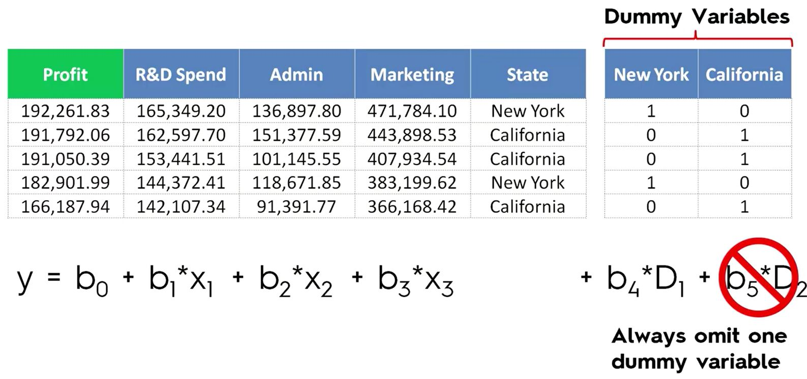
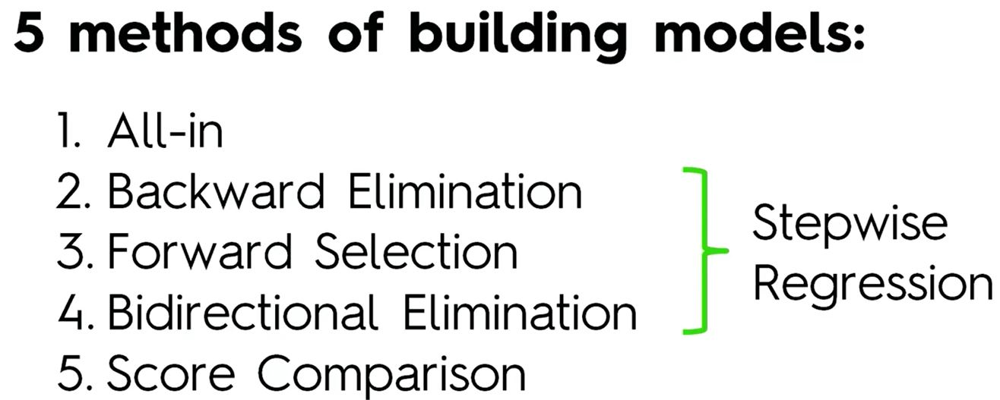
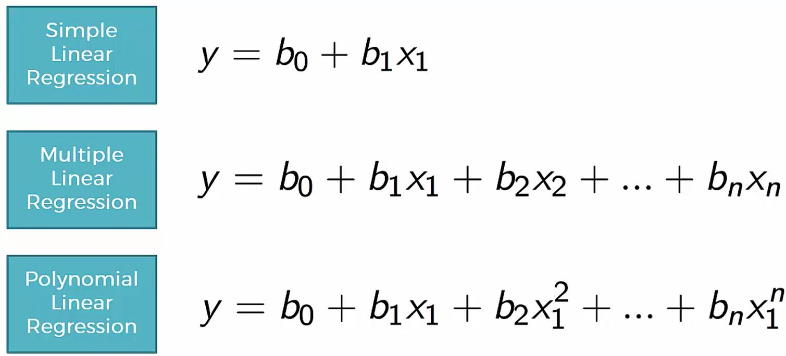

```{r, out.width = "400px", echo=FALSE}

```

## Simple Linear Regression
```{r simpleregession, warning=FALSE, message=FALSE}

# Importing the dataset
dataset = read.csv("../data/Salary_Data.csv")

# Splitting the dataset into the Training set and Test set
# install.packages('caTools')
library(caTools)
set.seed(123)
split = sample.split(dataset$Salary, SplitRatio = 2/3)
training_set = subset(dataset, split == TRUE)
test_set = subset(dataset, split == FALSE)

# Feature Scaling - Not needed - the model takes care of this for us
# (Always read about the model to determine in scaling is not autmatically.)
# training_set = scale(training_set)
# test_set = scale(test_set)

# Fitting Simple Linear Regression to the Training set
regressor = lm(formula = Salary ~ YearsExperience,
               data = training_set)

# Predicting the Test set results
y_pred = predict(regressor, newdata = test_set)
y_pred

# Visualising the Training set results
library(ggplot2)
ggplot() +
  geom_point(aes(x = training_set$YearsExperience, y = training_set$Salary),
             colour = 'red') +
  geom_line(aes(x = training_set$YearsExperience, y = predict(regressor, newdata = training_set)),
            colour = 'blue') +
  ggtitle('Salary vs Experience (Training set)') +
  xlab('Years of experience') +
  ylab('Salary')

# Visualising the Test set results
library(ggplot2)
ggplot() +
  geom_point(aes(x = test_set$YearsExperience, y = test_set$Salary), colour = 'red') +
  geom_line(aes(x = training_set$YearsExperience, y = predict(regressor, newdata = training_set)), colour = 'blue') +
  ggtitle('Salary vs Experience (Test set)') + xlab('Years of experience') + ylab('Salary')
```

##Assumptions of a linear regression

These must be true:

1. Linearity
2. Multivariate normality
3. Lack of multicollinearity
4. Independence of errors
5. Homoscedasticity

> In Linear regression the sample size rule of thumb is that regression analysis requires at least 20 cases per independent variable in the analysis.

### 1 - Linearity
linear regression needs the relationship between the independent and dependent variables to be linear.  It is also important to check for outliers since linear regression is sensitive to outlier effects.  The linearity assumption can best be tested with scatter plots, the following two examples depict two cases, where no and little linearity is present.

```{r, out.width = "300px", echo=FALSE}

```

### 2 - Multivariate normality

Linear regression analysis requires all variables to be multivariate normal.  This assumption can best be checked with a histogram and a fitted normal curve or a Q-Q-Plot.  

```{r, out.width = "300px", echo=FALSE}

```

### 3 - Lack of multicollinearity
Linear regression assumes that there is little or no multicollinearity in the data.  Multicollinearity occurs when the independent variables are not independent from each other.  A second important independence assumption is that the error of the mean has to be independent from the independent variables.

Multicollinearity might be tested with 4 central criteria:

1. Correlation matrix – when computing the matrix of Pearson's Bivariate Correlation among all independent variables the correlation coefficients need to be smaller than 1.
2. Tolerance – the tolerance measures the influence of one independent variable on all other independent variables; the tolerance is calculated with an initial linear regression analysis.  Tolerance is defined as T = 1 – R² for these first step regression analysis.  With T < 0.1 there might be multicollinearity in the data and with T < 0.01 there certainly is.
3. Variance Inflation Factor (VIF) – the variance inflation factor of the linear regression is defined as VIF = 1/T. Similarly with VIF > 10 there is an indication for multicollinearity to be present; with VIF > 100 there is certainly multicollinearity in the sample.
4. Condition Index – the condition index is calculated using a factor analysis on the independent variables.  Values of 10-30 indicate a mediocre multicollinearity in the linear regression variables, values > 30 indicate strong multicollinearity.

If multicollinearity is found in the data centering the data, that is deducting the mean score might help to solve the problem.  Other alternatives to tackle the problems is conducting a factor analysis and rotating the factors to insure independence of the factors in the linear regression analysis.

### 4 - Independence of errors

Linear regression analysis requires that there is little or no autocorrelation in the data.  Autocorrelation occurs when the residuals are not independent from each other.  In other words when the value of y(x+1) is not independent from the value of y(x). 

While a scatterplot allows you to check for autocorrelations, you can test the linear regression model for autocorrelation with the Durbin-Watson test.  Durbin-Watson's d tests the null hypothesis that the residuals are not linearly auto-correlated.  While d can assume values between 0 and 4, values around 2 indicate no autocorrelation.  As a rule of thumb values of 1.5 < d < 2.5 show that there is no auto-correlation in the data, however the Durbin-Watson test only analyses linear autocorrelation and only between direct neighbors, which are first order effects.

### 5 - Homoscedasticity

Homoscedasticity describes a situation in which the error term (that is, the “noise” or random disturbance in the relationship between the independent variables and the dependent variable) is the same across all values of the independent variables.  

The last assumption the linear regression analysis makes is homoscedasticity.  The scatter plot is good way to check whether homoscedasticity (that is the error terms along the regression are equal) is given. If the data is heteroscedastic the scatter plots looks like the following examples:

```{r, out.width = "300px", echo=FALSE}

```

Recall that ordinary least-squares (OLS) regression seeks to minimize residuals and in turn produce the smallest possible standard errors.  By definition, OLS regression gives equal weight to all observations, but when heteroscedasticity is present, the cases with larger disturbances have more “pull” than other observations.  In this case, weighted least squares regression would be more appropriate, as it down-weights those observations with larger disturbances.

A more serious problem associated with heteroscedasticity is the fact that the standard errors are biased.  Because the standard error is central to conducting significance tests and calculating confidence intervals, biased standard errors lead to incorrect conclusions about the significance of the regression coefficients.  Many statistical programs provide an option of robust standard errors to correct this bias.  Weighted least squares regression also addresses this concern but requires a number of additional assumptions.  Another approach for dealing with heteroscedasticity is to transform the dependent variable using one of the variance stabilizing transformations.  A logarithmic transformation can be applied to highly skewed variables, while count variables can be transformed using a square root transformation.  Overall however, the violation of the homoscedasticity assumption must be quite severe in order to present a major problem given the robust nature of OLS regression.

> Remember, for linear regression you need to transform categorical variables into dummy variables.

```{r, out.width = "400px", echo=FALSE}

```

### Building Models
```{r, out.width = "300px", echo=FALSE}

```

```{r multLinRegression, warning=FALSE, message=FALSE}

# Importing the dataset
dataset = read.csv("../data/50_Startups.csv")

# Encoding categorical data
dataset$State = factor(dataset$State, levels = c('New York', 'California', 'Florida'), labels = c(1, 2, 3))

# Splitting the dataset into the Training set and Test set
# install.packages('caTools')
library(caTools)
set.seed(123)
split = sample.split(dataset$Profit, SplitRatio = 0.8)
training_set = subset(dataset, split == TRUE)
test_set = subset(dataset, split == FALSE)

# Feature Scaling
# training_set = scale(training_set)
# test_set = scale(test_set)

# Fitting Multiple Linear Regression to the Training set
regressor = lm(formula = Profit ~ ., data = training_set)

# Predicting the Test set results
y_pred = predict(regressor, newdata = test_set)

# Building the optimal model using Backward Elimination
regressor = lm(formula = Profit ~ R.D.Spend + Administration + Marketing.Spend + State, data = dataset)
summary(regressor)
# Optional Step: Remove State2 only (as opposed to removing State directly)
# regressor = lm(formula = Profit ~ R.D.Spend + Administration + Marketing.Spend + factor(State, exclude = 2),
#                data = dataset)
# summary(regressor)
regressor = lm(formula = Profit ~ R.D.Spend + Administration + Marketing.Spend, data = dataset)
summary(regressor)
regressor = lm(formula = Profit ~ R.D.Spend + Marketing.Spend, data = dataset)
summary(regressor)
regressor = lm(formula = Profit ~ R.D.Spend, data = dataset)
summary(regressor)
```

## Multiple Linear Regression

```{r}
# Importing the dataset
dataset = read.csv("../data/50_Startups.csv")

# Encoding categorical data
dataset$State = factor(dataset$State,
                       levels = c('New York', 'California', 'Florida'), labels = c(1, 2, 3))

# Splitting the dataset into the Training set and Test set
# install.packages('caTools')
library(caTools)
set.seed(123)
split = sample.split(dataset$Profit, SplitRatio = 0.8)
training_set = subset(dataset, split == TRUE)
test_set = subset(dataset, split == FALSE)

# Feature Scaling
# training_set = scale(training_set)
# test_set = scale(test_set)

# Fitting Multiple Linear Regression to the Training set
regressor = lm(formula = Profit ~ ., data = training_set)

# Predicting the Test set results
y_pred = predict(regressor, newdata = test_set)
```

## Polynomial Linear Regression

```{r, out.width = "300px", echo=FALSE}

```


```{r polyLinRegression, warning=FALSE, message=FALSE}
# Importing the dataset
dataset = read.csv("../data/Position_Salaries.csv")
dataset = dataset[2:3]

# Splitting the dataset into the Training set and Test set
# # install.packages('caTools')
# library(caTools)
# set.seed(123)
# split = sample.split(dataset$Salary, SplitRatio = 2/3)
# training_set = subset(dataset, split == TRUE)
# test_set = subset(dataset, split == FALSE)

# Feature Scaling
# training_set = scale(training_set)
# test_set = scale(test_set)

# Fitting Linear Regression to the dataset
lin_reg = lm(formula = Salary ~ ., data = dataset)

# Fitting Polynomial Regression to the dataset
dataset$Level2 = dataset$Level^2
dataset$Level3 = dataset$Level^3
dataset$Level4 = dataset$Level^4
poly_reg = lm(formula = Salary ~ ., data = dataset)

# Visualising the Linear Regression results
# install.packages('ggplot2')
library(ggplot2)
ggplot() +
  geom_point(aes(x = dataset$Level, y = dataset$Salary), colour = 'red') +
  geom_line(aes(x = dataset$Level, y = predict(lin_reg, newdata = dataset)), colour = 'blue') +
  ggtitle('Truth or Bluff (Linear Regression)') + xlab('Level') + ylab('Salary')

# Visualising the Polynomial Regression results
# install.packages('ggplot2')
library(ggplot2)
ggplot() + geom_point(aes(x = dataset$Level, y = dataset$Salary), colour = 'red') +
  geom_line(aes(x = dataset$Level, y = predict(poly_reg, newdata = dataset)), colour = 'blue') +
  ggtitle('Truth or Bluff (Polynomial Regression)') + xlab('Level') + ylab('Salary')

# Visualising the Regression Model results (for higher resolution and smoother curve)
# install.packages('ggplot2')
library(ggplot2)
x_grid = seq(min(dataset$Level), max(dataset$Level), 0.1)
ggplot() + geom_point(aes(x = dataset$Level, y = dataset$Salary), colour = 'red') +
          geom_line(aes(x = x_grid, y = predict(poly_reg,
          newdata = data.frame(Level = x_grid, Level2 = x_grid^2, Level3 = x_grid^3, Level4 = x_grid^4))), 
          colour = 'blue') + ggtitle('Truth or Bluff (Polynomial Regression)') + xlab('Level') +  ylab('Salary')

# Predicting a new result with Linear Regression
predict(lin_reg, data.frame(Level = 6.5))

# Predicting a new result with Polynomial Regression
predict(poly_reg, data.frame(Level = 6.5, Level2 = 6.5^2, Level3 = 6.5^3, Level4 = 6.5^4))
```

