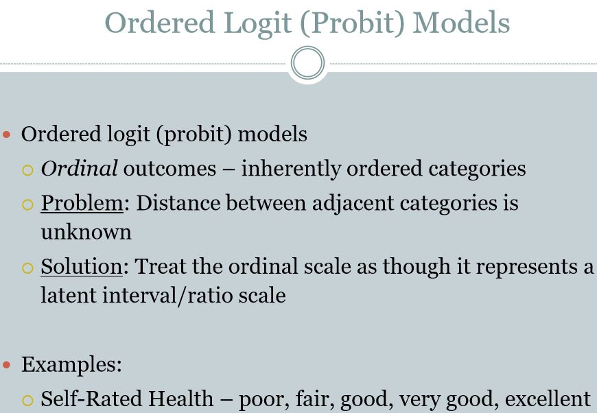

```{r echo=FALSE, warning=FALSE, message=FALSE}
if(!require(easypackages)){install.packages("easypackages")}
library(easypackages)
packages("caret", "ISLR", "dplyr", "ggplot2", prompt = FALSE)
```

## Regression Introduction

```{r out.width = "500px", echo=FALSE}


```

Two basic types of regression:

- Linear Regression
- Logistic Regression

## Linear Regression R Code

```{r}
#Predicting with Linear Regression

# Load Data
data(faithful)
glimpse(faithful)
set.seed(333)

inTrain <- createDataPartition(y=faithful$waiting, p=0.5, list=FALSE)#list=FALSE makes inTrain a matrix rather than a list
trainFaith <- faithful[inTrain, ]
testFaith <- faithful[-inTrain, ]

# Fit a linear Model
lm_model<-lm(eruptions ~ waiting, data = trainFaith)
summary(lm_model)

# plot a Model Fit
{plot(trainFaith$waiting, trainFaith$eruptions, pch=19, col="blue", xlab="Waiting", ylab="Duration")
# fit a line along the points
lines(trainFaith$waiting, lm_model$fitted, lwd=3)}

# Predict a new value
newdata <- data.frame(waiting = 80)
predict(lm_model, newdata)

# Prediction Intervals
pred1 <- predict(lm_model, newdata = testFaith, interval="prediction")
ord <- order(testFaith$waiting)
{plot(testFaith$waiting, testFaith$eruptions, pch=19, col="blue")
matlines(testFaith$waiting[ord], pred1[ord,], type="l", col=c(1,2,2), lty=c(1,1,1), lwd=3)}
```

## Multiple Covariates Regression R Code

```{r}
#Predicting with Regression Multiple Covariates
data(Wage)
glimpse(Wage)

# Remove logwage varaiable from the dataset
Wage<-subset(Wage,select=-c(logwage))

# Get the training and testing dataset
inTrain <- createDataPartition(y = Wage$wage, p=0.7, list=FALSE)
training <- Wage[inTrain, ]
testing <-Wage [-inTrain, ]

# Fit a linear Model
modFit<-train(wage ~ age + jobclass + education, method="lm", data=training)
summary(modFit)
finMod <- modFit$finalModel
modFit

# Diagonistic Plot
plot(finMod, pch=19, cex=0.5, col="#00000010")
# here on x axis we will plot a fitted value, Fitted value is the prediction of the model of the training set
# and On y axis we will use Residuals that the amount of variation thats occur to fit the model.
# This plot is mainly used to detect non-linearity, unequal error variances and outliers.
# and you can see that on top of this graph some numbers are represented it is outliers

# Predicted versus truth in test dataset
pred <- predict(modFit, testing)
qplot(wage, pred, colour = race, data = testing)

```

## Predicting with Logistic Regression

```{r out.width = "500px", echo=FALSE}

```

Logistic Regression is used when:

- Dependent variable is Categorical
- Independent variables are either Continuopus or Categorical

```{r out.width = "500px", echo=FALSE}




knitr::include_graphics("../images/ML2_Logistic22.JPG")
```

## Logistic Regression R Code

```{r}
data(Smarket)
glimpse(Smarket)#Stock market Data

train<-subset(Smarket, Year<2005)
test<-subset(Smarket, Year==2005)

# Perform Logistic Regression
logit <- glm(Direction ~ Lag1 + Lag2 + Lag3, family='binomial', data=train)
#Ordered Logistic is

# Run the model on the test set
test.probs <-predict(logit, test, type='response')
test.probs
pred.logit <- rep('Down', length(test.probs))
pred.logit[test.probs >= 0.5] <- 'Up'
pred.logit
table(pred.logit, test$Direction)
```

