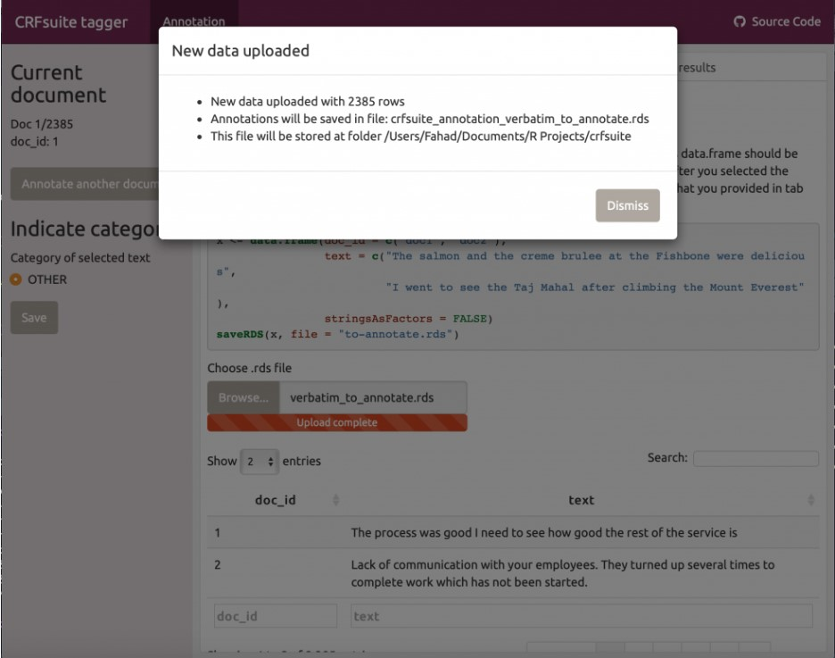
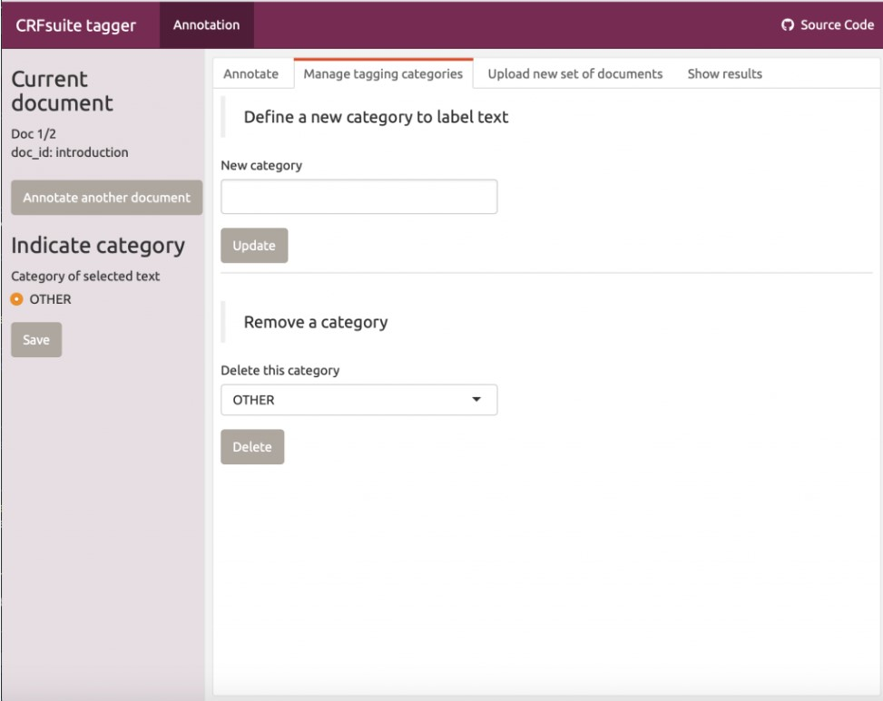
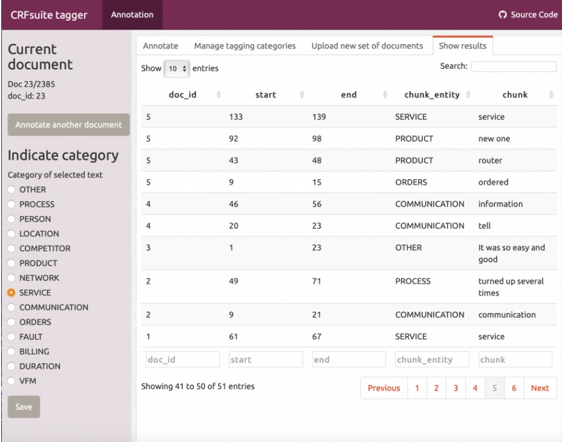

<style type="text/css">
p{ /* Normal  */
   font-size: 14px;
   line-height: 18px;}
body{ /* Normal  */
   font-size: 14px;}
td {  /* Table  */
   font-size: 12px;}
h1 { /* Header 1 */
 font-size: 26px;
 color: #4294ce;}
h2 { /* Header 2 */
 font-size: 22px;}
h3 { /* Header 3 */
 font-size: 18px;}
code.r{ /* Code block */
  font-size: 12px;}
pre { /* Code block */
  font-size: 12px}
#table-of-contents h2 {
  background-color: #4294ce;}
#table-of-contents{
  background: #688FAD;}
#nav-top span.glyphicon{
  color: #4294ce;}
#postamble{
  background: #4294ce;
  border-top: ;}
</style>

```{r echo=FALSE, warning=F, message=F}
#devtools::install_github("bnosac/crfsuite", build_vignettes = TRUE)
#devtools::install_github("fahadshery/textsummary")

if(!require(easypackages)){install.packages("easypackages")}
library(easypackages)
packages("tidyverse", "crfsuite", "textSummary", "udpipe",  prompt = TRUE)

options(digits = 3)

setwd("~/GitHub/MachineLearning/Models/NLP_TextMining")
```

# Package Notes:

__crfsuite__:  CRFsuite is an implementation of Conditional Random Fields algorithm. This R package wraps the CRFsuite C/C++ library (https://github.com/chokkan/crfsuite), allowing the following:

- Fit a Conditional Random Field model (1st-order linear-chain Markov)
- Use the model to get predictions alongside the model on new data
- The focus of the implementation is in the area of Natural Language Processing where this R package allows you to easily build and apply models for named entity recognition, text chunking, part of speech tagging, intent recognition or classification of any category you have in mind.

A small web application is included in the package to allow you to easily construct training data.

For users unfamiliar with Conditional Random Field (CRF) models, you can read this excellent tutorial http://homepages.inf.ed.ac.uk/csutton/publications/crftut-fnt.pdf

__- textSummary:  An Awesome package to quickly present text summaries, build plots and LDA models. You can also create word clouds.  Used herein only for text data.  https://github.com/fahadshery/textsummary

# Process

1. You need to have `doc_id` column within your dataset.
2. Save the dataset in `rds` format because the shinyApp expects this format
3. Load the `rds` file within the shinyApp to annotate
4. Once you have the annotated file, do POS tagging either using `UDPipe` or some other package like `RDRPOSTagger` which you can install from cran
5. `Merge` the annotated and tokenised datasets
6. bind the `crf attributes` with the merged dataset.
7. `Train` the model
8. Test the model using `predict` method

# Data

```{r}
verbatims <- verbatim
glimpse(verbatims)
```

# Process Steps Executed

## Step 1: Add `doc_id`

As mentioned, need to have `doc_id` in the dataset which you can add by:

```{r}
verbatims <- verbatims %>% mutate(doc_id = row_number()) %>% select(doc_id,text)
glimpse(verbatims)
```

## Step 2: Save RDS

```{r eval=FALSE}
#save it as RDS to be loaded on to the shiny app for annotation
saveRDS(verbatims, "./data/verbatim_to_annotate.rds")
```

## Step 3: Load Shiny App

Make sure to upload the RDS file saved in Step 2.

```{r eval=FALSE}
#Now start the app by:
rmarkdown::run(system.file(package = "crfsuite", "app", "annotation.Rmd"))
```

```{r, out.width = "300px", echo=FALSE}

```

You can add your own categories using the Manage tagging categories tab. Then click on Annotate Tab to begin annotation. Once you are done with annotating a particular verbatim/sentence/text part then click Annotate another document button to move to the next document.

```{r, out.width = "300px", echo=FALSE}

```

The good news is that you don’t have to annotate the whole dataset. If you close the app. It will save the file with the annotations you have already completed. You can see a preview of the annotations you have completed by clicking on the Show results tab:

```{r, out.width = "300px", echo=FALSE}

```

Once you close the app, it will create a new file within your working directory called: `crfsuite_annotation_verbatim_to_annotate.rds` You can load this file by simply clicking on the file within RStudio or by executing the command: 

```{r}
crfsuite_annotation_verbatim_to_annotate <- readRDS("crfsuite_annotation_verbatim_to_annotate.rds")
```

## Step 4" POS Tagging

Now that you have your annotated file. We need to move to the next phase where we need to have tokenised version of our text file with POS (parts of speech) tagging.

`UDPipe` comes with pre-trained models for POS and sentence tokenisation. To build crf models you need a model either trained by yourself or use pre-trained ones supplied by UDPipe community that can do POS tagging, sentence breaking etc. (Using an english model because the data is in English. You can either download these models in other languages too.)

### Getting pre-trained models:

There are 3 english models named: `english`, `english-partut` and `english-lines`. Prefer `english-partut` because it also provides lemmas when performing POS and tokenisation.

```{r}
udmodel <- udpipe_download_model("english-partut")
udmodel <- udpipe_load_model(udmodel$file_model)
```

if you’ve already downloaded a model then load the model by specifying the model file name as:

```{r eval=FALSE}
udmodel <- udpipe_load_model("english-partut-ud-2.0-170801.udpipe")
```

A commercially model which is downloaded from here: https://github.com/bnosac/udpipe.models.ud:

```{r}
verbatims_tokens <- udpipe(verbatims, "english", udpipe_model_repo = "bnosac/udpipe.models.ud")
```
The above line will automatically do the sentence breaking and POS and lemmatization. However, you can do this using your own downloaded model by:

```{r eval=FALSE}
verbatims <- unique(crfsuite_annotation_verbatim_to_annotate[, c("doc_id", "text")])
```

Can use the downloaded model to annotate i.e. POS, sentence breaking etc.

```{r}
verbatim_tokens <- udpipe_annotate(udmodel, x = verbatims$text, doc_id = verbatims$doc_id)
class(verbatim_tokens)

verbatim_tokens <- as.data.frame(verbatim_tokens)
```

## Step 5: Merge Annotated / Tokenized Datasets

```{r}
x <- merge(crfsuite_annotation_verbatim_to_annotate, verbatim_tokens)
glimpse(x)
```

## Step 6: Bind `crf attributes`

```{r}
x <- crf_cbind_attributes(x, terms = c("upos", "lemma"), by = "doc_id")
glimpse(x)
```

## Step 7: Train the model

Now you are ready to build the model. By default, the CRF model is trained using L-BFGS with L1/L2 regularization but other training methods are also available: 

- SGD with L2-regularization
- Averaged Perceptron
- Passive Aggressive or Adaptive Regularization of Weights.

In the below example, use the default parameters and decrease the iterations a bit to have a model ready quickly.

Provide the label with the categories (y) and the attributes of the observations (x) and indicate what is the sequence group (in this case we take `doc_id`).

The model will be saved to your working directory as `tagger.crfsuite`

> Problem here:  text data not sufficient all chunk_entity = O. . . .

```{r}
model <- crf(y = x$chunk_entity, x = x[, grep("upos|lemma", colnames(x), value = TRUE)],
             group = x$doc_id, method = "lbfgs", file = "tagger.crfsuite", options = list(max_iterations = 15))

stats <- summary(model)
```

Check the loss evaluation by:

```{r}
plot(stats$iterations$loss, pch = 20, type = "b", main = "Loss evolution", xlab = "Iteration", ylab = "Loss")
```

## Step 8: Test model with `predict`


Now it’s time to test the model and get our predictions of the named entity / chunks / categories you have trained.

This should be done on the training/ holdout data. Provide the model, your data with the attributes and indicate the group the attributes belong to.

```{r}
scores <- predict(model, 
                  newdata = crf_test[, c("pos", "pos_previous", "pos_next", 
                                         "token", "token_previous", "token_next")], 
                  group = crf_test$doc_id)

#get the labels by the model
crf_test$entity <- scores$label
#Build the confusion matrix:
table(crf_test$entity, crf_test$label)
```

That’s it you are done now! You should play with other tweaking arguments when training the model to see if it could improve the accuracy of your model.

# Reference:

https://fahadusman.com/custom-model-training-using-crfsuite-in-r/