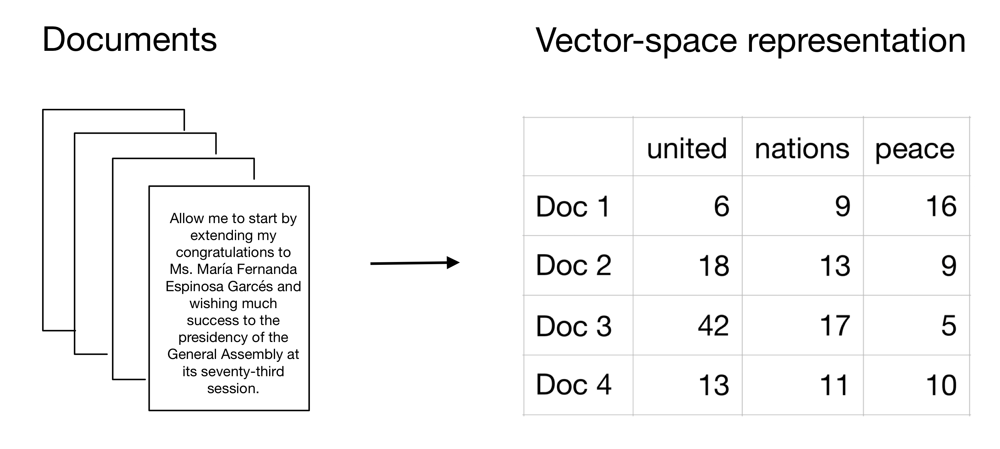
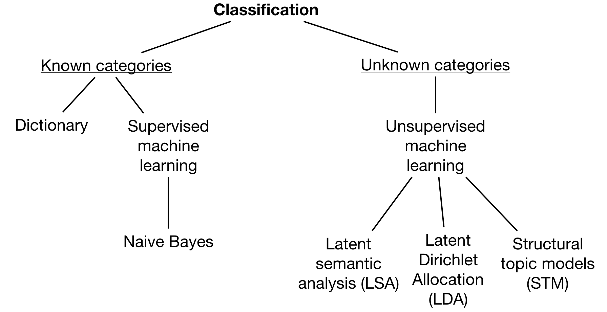

```{r setup, include=FALSE}
knitr::opts_knit$set(
     echo = TRUE,
     message = FALSE,
     warning = FALSE,
     out.width = "100%",
     fig.align = "center")
```

```{r echo=FALSE, warning=FALSE, message=FALSE}
if(!require(easypackages)){install.packages("easypackages")}
library(easypackages)
packages("tidyverse", "quanteda", "readtext", "stm", "stminsights", "wordcloud",
         "gsl", "topicmodels", "caret", prompt = FALSE)

# library(stm)              # For structural topic models
# library(stminsights)      # For visual exploration of STM
# library(gsl)              # Required for the topicmodels package

setwd("~/GitHub/MachineLearning/Models/NLP_TextMining")
```

# Introduction

What is `quanteda`?

In order to analyze text data, R has several packages available. `quanteda` is one of the most popular R packages for the quantitative analysis of textual data that is fully-featured and allows the user to easily perform natural language processing tasks. It offers an extensive documentation and is regularly updated. `quanteda` is most useful for preparing data that can then be further analyzed using unsupervised/supervised machine learning or other techniques. A combination with `tidyverse` leads to a more transparent code structure.

There are also similar R packages such as `tm`, `tidytext`, and `koRpus.` 

- `tm` has simpler grammer but slightly fewer features
- `tidytext` is very closely integrated with `dplyr` and well-documented
- `koRpus` is good for tasks such as part-of-speech (POS) tagging)

How do we use quanteda?

Most analyses in quanteda require three steps:

1. Import the data

The data that we usually use for text analysis is available in text formats (e.g., .txt or .csv files).

2. Build a corpus

After reading in the data, we need to generate a corpus. A corpus is a type of dataset that is used in text analysis. It contains a collection of text or speech material that has been brought together according to a certain set of predetermined criteria. These criteria are usually set by the researchers and are in concordance with the guiding question. For instance, if you are interested in analyzing speeches in the UN General Debate, these predetermined criteria are the time and scope conditions of these debates (speeches by countries at different points in time).

3. Calculate a data frequency matrix (DFM)

Another essential component for text analysis is a data frequency matrix (DFM); also called document-term matrix (DTM). These two terms are synonyms but quanteda refers to a DFM whereas others will refer to DTM. It describes how frequently terms occur in the corpus by counting single terms. To generate a DFM, we first split the text into its single terms (tokens). We then count how frequently each term (token) occurs in each document.

The following graphic describes visually how we turn raw text into a vector-space representation that is easily accessible and analyzable with quantitative statistical tools. It also visualizes how we can think of a DFM. The rows represent the documents that are part of the corpus and the columns show the different terms (tokens). The values in the cells indicate how frequently these terms (tokens) are used across the documents.

```{r, out.width = "300px", echo=FALSE}

```

Important things to remember about DFMs:

- A corpus is positional (string of words) and a DFM is non-positional (bag of words). Put differently, the order of the words matters in a corpus whereas a DFM does not have information on the position of words.
- A token is each individual word in a text (but it could also be a sentence, paragraph, or character). This is why we call creating a “bag of words” also tokenizing text. In a nutshell, a DFM is a very efficient way of organizing the frequency of features/tokens but does not contain any information on their position. In our example, the features of a text are represented by the columns of a DFM and aggregate the frequency of each token.
- In most projects you want one corpus to contain all your data and generate many DFMs from that.
- The rows of a DFM can contain any unit on which you can aggregate documents. In the example above, we used the single documents as the unit. It may also well be more fine-grained with sub-documents or more aggregated with a larger collection of documents.
- The columns of a DFM are any unit on which you can aggregate features. Features are extracted from the texts and quantitatively measurable. Features can be words, parts of the text, content categories, word counts, etc. In the example above, we used single words such as “united”, “nations”, and “peace”.

> Terrific example of [Text Mining with R and quanteda](http://cbpuschmann.net/quanteda_mzes/)  Better than the example provided in this document!

# Data
      
Use the UN General Debate data. While there is is a pre-processed version of the dataset accessible with `quanteda.corpora`, use the original dataset to match the workflow of textual data in R.   Download the data [here](https://dataverse.harvard.edu/dataset.xhtml?persistentId=doi:10.7910/DVN/0TJX8Y) and unzip the zip file. 

Load the data (.txt files) from all subfolders (`readtext` handles this automatically) and store them in `UNGDspeeches` dataframe. 

```{r message=FALSE, warning=FALSE, eval=FALSE}
UNGDspeeches <- readtext(paste0("d:/LargeData/quanteda/data/", "*/*.txt"),
                         docvarsfrom = "filenames", 
                         docvarnames = c("country", "session", "year"), dvsep = "_",
                         encoding = "UTF-8")
```

Generate a corpus.

```{r eval=FALSE}
mycorpus <- corpus(UNGDspeeches, country = "country")
```

```{r eval=FALSE}
# Assign a unique identifier to each text
docvars(mycorpus, "Textno") <- sprintf("%02d", 1:ndoc(mycorpus)) 

saveRDS(mycorpus, "D:/LargeData/mycorpus.rds")
```

```{r}
mycorpus <- readRDS("d:/LargeData/mycorpus.rds")
mycorpus
```

With this data, generate descriptive statistics.

```{r}
# Save statistics in "mycorpus.stats"
mycorpus.stats <- summary(mycorpus)

# And print the statistics of the first 10 observations
head(mycorpus.stats, n = 10)
```

Next calculate the data frequency matrix. First generate tokens (`tokens()`) and pre-process the data. This includes removing the numbers, punctuations, symbols, twitter characters such as @ and #, urls beginning with http(s), and hyphens. 

Include the docvars from the corpus (`include_docvars`).

## Preprocess the text
```{r eval=FALSE}
# Create tokens
token <-
  tokens(mycorpus, remove_numbers = TRUE, remove_punct = TRUE, remove_symbols = TRUE,
         remove_twitter = TRUE, remove_url = TRUE, remove_hyphens = TRUE, 
         include_docvars = TRUE)
```

Since the pre-1994 documents were scanned with OCR scanners, several tokens with combinations of digits and characters were introduced. Clean them manually.

```{r eval=FALSE}
# Clean tokens created by OCR
token_ungd <- tokens_select(token, c("[\\d-]", "[[:punct:]]", "^.{1,2}$"),
                            selection = "remove", valuetype = "regex", verbose = TRUE)
```

`removed 4,620 features`

Create the data frequency matrix. Lower case and stem the words (`tolower` and `stem`) and remove common stop words (`remove=stopwords()`). Stopwords are words that appear in texts but do not give the text a substantial meaning (e.g., “the”, “a”, or “for”). Since the language of all documents is English, we only remove English stopwords here. `quanteda` can also deal with stopwords from other languages.

```{r eval=FALSE}
mydfm <- dfm(token_ungd, tolower = TRUE, stem = TRUE, remove = stopwords("english"))
saveRDS(mydfm, "data/mydfm.rds")
```

Trim the text with `dfm_trim.` Using the command and its respective specifications, filter words that appear less than 7.5% and more than 90%. This conservative approach is possible because there is a sufficiently large corpus.

```{r}
mydfm <- readRDS("data/mydfm.rds")
mydfm.trim <- dfm_trim(mydfm, min_docfreq = 0.075, max_docfreq = 0.90, docfreq_type = "prop") 
```

Print their first 10 observations and first 10 features:

```{r}
head(dfm_sort(mydfm.trim, decreasing = TRUE, margin = "both"), n = 10, nf = 10) 
```

The sparsity gives us information about the proportion of cells that have zero counts.

# Classification

A next step can involve the classification of the text. Classification sorts texts into categories. 
```{r, out.width = "300px", echo=FALSE}

```

A data scientist either knows the categories or not.  The data scientist can use automated methods to minimize the workload that is associated with the categorization of the texts. Thus, either a dictionary method and a supervised method or unsupervised machine learning. 

# Known Categories

## Known Categories: Dictionaries

Dictionaries contain lists of words that correspond to different categories. If we apply a dictionary approach, we count how often words that are associated with different categories are represented in each document. These dictionaries help us to classify (or categorize) the speeches based on the frequency of the words that they contain. Popular dictionaries are sentiment dictionaries (such as Bing, Afinn or LIWC) or LexiCoder.

The _LexiCoder Policy Agenda_ dictionary that can be accessed [here](http://www.lexicoder.com/download/) in a `.lcd` format. The _LexiCoder Policy Agenda_ dictionary captures major topics from the comparative Policy Agenda project and is currently available in Dutch and English.

To read in the dictionary, use quanteda’s built-in function `dictionary()`.

```{r}
# load the dictionary with quanteda's built-in function
dict <- dictionary(file = "./data/policy_agendas_english.lcd")
```

We apply this dictionary to filter the share of each country’s speeches on immigration, international affair and defence.

```{r}
mydfm.un <- dfm(mydfm.trim, groups = "country", dictionary = dict)

un.topics.pa <- convert(mydfm.un, "data.frame") %>%
  dplyr::rename(country = document) %>%
  select(country, immigration, intl_affairs, defence) %>%
  tidyr::gather(immigration:defence, key = "Topic", value = "Share") %>%
  group_by(country) %>%
  mutate(Share = Share / sum(Share)) %>%
  mutate(Topic = haven::as_factor(Topic))
```

Next visualize the results with `ggplot.` This gives us a first impression of the distribution of the topics in the 2018 UN General Debate across countries.

```{r}
un.topics.pa %>% ggplot(aes(country, Share, color = Topic, fill = Topic)) +
     geom_bar(stat = "identity") + scale_colour_brewer(palette = "Set1") +
     scale_fill_brewer(palette = "Pastel1") +
     ggtitle("Distribution of PA topics in the UN General Debate corpus") +
     xlab("") + ylab("Topic share (%)") + theme(axis.text.x = element_blank(),
                                                axis.ticks.x = element_blank())
```

Observe a relatively high share for both defence and international affairs whereas immigration receives fewer attention in the speeches.

## Known Categories: Supervised ML - Naive Bayes

Similar to the dictionary approach, this method also requires some pre-existing classifications. But in contrast to a dictionary, now divide the data into a training and a test dataset. This follows the general logic of machine learning algorithms. The training data already contains the classifications and trains the algorithm (e.g., our Naive Bayes classifier) to predict the class of our speech based on the features that are given. A Naive Bayes classifier now calculates the probability for each class based on the features. It eventually goes for the class with the highest probability and selects this class as the corresponding category. 

### Bayes’ Theorem

Why is Naive Bayes _naive_? Naive Bayes is _naive_ because of its strong independence assumptions. It assumes that all features are equally important and that all features are independent. If you think of n-grams and compare unigrams and bigrams, you can intuitively understand why the last assumption is a strong assumption. A unigram counts each word as a gram ( _I_ _like_ _walking_ _in_ _the_ _sun_) whereas a bigram counts two words as a gram ( _I like_ _like walking_ _walking in_ _in the_ _the sun_ ).

However, even when the assumptions are not fully met, Naive Bayes still performs well.

A Naive Bayes is a relatively simple classification algorithm because it does not require much time and working capacity of your machine. To use a Naive Bayes classifier, rely on quanteda’s built-in function `textmodel_nb`.

To perform the Naive Bayes estimation, proceed with the following steps:

1. Set up training and test data based on the corpus.
2. Based on these two datasets, generate a DFM.
3. Train the algorithm by feeding in the training data and eventually use the test data for performance.
4. Check the performance (accuracy) of the results.
5. Compare it with a random prediction.

For this example, use the pre-labeled dataset that is used for the algorithm `newsmap` by Kohei Watanabe. The dataset contains information on the geographical location of newspaper articles. 

First load the dataset. To do so, we follow Kohei Watanabe’s description here, download the corpus of [Yahoo News from 2014](https://www.dropbox.com/s/e19kslwhuu9yc2z/yahoo-news.RDS?dl=1), and follow the subsequent processing steps he describes.

```{r eval=FALSE}
# Copied from https://github.com/koheiw/Newsmap
setwd("~/GitHub/MachineLearning/Models/NLP_TextMining")

library(newsmap)
library(quanteda)

data <- readRDS('D:/LargeData/yahoo-news.RDS')
data$text <- paste0(data$head, ". ", data$body)
data$body <- NULL
corp <- corpus(data, text_field = 'text')

# Custom stopwords
month <- c('January', 'February', 'March', 'April', 'May', 'June',
           'July', 'August', 'September', 'October', 'November', 'December')
day <- c('Sunday', 'Monday', 'Tuesday', 'Wednesday', 'Thursday', 'Friday', 'Saturday')
agency <- c('AP', 'AFP', 'Reuters')

# Select training period
sub_corp <- corpus_subset(corp, '2014-01-01' <= date & date <= '2014-12-31')

# Tokenize
toks <- tokens(sub_corp)
toks <- tokens_remove(toks, stopwords('english'), valuetype = 'fixed', padding = TRUE)
toks <- tokens_remove(toks, c(month, day, agency), valuetype = 'fixed', padding = TRUE)

# quanteda v1.5 introduced 'nested_scope' to reduce ambiguity in dictionary lookup
label_toks <- tokens_lookup(toks, data_dictionary_newsmap_en, 
                            levels = 3, nested_scope = "dictionary")
label_dfm <- dfm(label_toks)

feat_dfm <- dfm(toks, tolower = FALSE)
feat_dfm <- dfm_select(feat_dfm, selection = "keep", '^[A-Z][A-Za-z1-2]+', 
                       valuetype = 'regex', case_insensitive = FALSE) 
                       # include only proper nouns to model
feat_dfm <- dfm_trim(feat_dfm, min_count = 10)
## Warning in dfm_trim.dfm(feat_dfm, min_count = 10): min_count is deprecated,
## use min_termfreq

model <- textmodel_newsmap(feat_dfm, label_dfm)

# Features with largest weights
coef(model, n = 7)[c("us", "gb", "fr", "br", "jp")]

pred_data <- data.frame(text = texts(sub_corp), country = predict(model))
```

```{r eval=FALSE}
# transform variables
pred_data$text <- as.character(pred_data$text)
pred_data$country <- as.character(pred_data$country)
```

For simplicity, we keep only the USA, Great Britain, France, Brazil, and Japan.

```{r eval=FALSE}
pred_data <- pred_data %>% dplyr::filter(country %in% c("us", "gb", "fr", "br", "jp")) %>%
     dplyr::select(text, country))

saveRDS(pred_data, "data/pred_data.rds")
```

```{r}
rm(list = ls())
pred_data <- readRDS("data/pred_data.rds")
head(pred_data)
```

Pre-process the data again. The final corpus includes the newspaper headlines by country.

```{r}
data_corpus <- corpus(pred_data, text_field = "text")
```

As a first step, define the training and test dataset. Based on these two datasets, generate a DFM. This code is based on [Cornelius code and quanteda’s example](http://cbpuschmann.net/quanteda_mzes/). To do so, apply similar general data pre-processing steps as discussed above.

```{r}
# Set a seed for replication purposes
set.seed(68159)

# Generate random 10,000 numbers without replacement
training_id <- sample(1:29542, 10000, replace = FALSE)

# Create docvar with ID
docvars(data_corpus, "id_numeric") <- 1:ndoc(data_corpus)

# Get training set
dfmat_training <- corpus_subset(data_corpus, id_numeric %in% training_id) %>% dfm(stem = TRUE)

# Get test set (documents not in training_id)
dfmat_test <-corpus_subset(data_corpus, !id_numeric %in% training_id) %>% dfm(stem = TRUE)
```

Now check the distribution of the countries across the two DFMs:

```{r}
prop.table(table(docvars(dfmat_training, "country")) * 100)
```

```{r}
prop.table(table(docvars(dfmat_test, "country")) * 100)
```

The countries are equally distributed across both DFMs.

Next, train the Naive Bayes classifier. Proceed and train our algorithm using quanteda’s built-in function `textmodel_nb`.

### Train Naive Bayes

```{r}
# The function takes a DFM as the first argument 
model.NB <- textmodel_nb(dfmat_training, docvars(dfmat_training, "country"), prior = "docfreq")

# The prior indicates an assumed distribution. Choose how frequently the categories occur in the data.
dfmat_matched <- dfm_match(dfmat_test, features = featnames(dfmat_training))
```

`summary(model.NB)` gives us the results of our prediction. 

```{r}
summary(model.NB)
```

To better understand how well NB did, generate two frequency tables for right and wrong predictions.

```{r}
prop.table(table(predict(model.NB) == docvars(dfmat_training, "country"))) * 100
```
 
To check if this result indicates a good performance, compare it with a random result. Randomize the list of countries (and keep the overall frequency distribution of our countries constant) to allow the random algorithm a legitimate chance for a correct classification.

```{r}
prop.table(table(sample(predict(model.NB)) == docvars(dfmat_training, "country"))) * 100
```

Naive Bayes classifier clearly outperforms a random algorithm.

```{r}
nb_table <- matrix(c(2.830966, 97.169034, 76.96109, 23.03891), ncol=2, byrow = TRUE)
colnames(nb_table) <- c("Naive Bayes", "Random")
rownames(nb_table) <- c("False", "True")
as.table(nb_table)
```

Likely to increase our accuracy even more by pre-processing the text data.

A confusion matrix helps us assess how well the algorithm performed. It shows the prediction for all five countries in contrast to the actual class that is given by our data. For example, it is predicted 2580 articles as belonging to Great Britain that actually belong to Great Britain.

However, it is also predicted 39 articles as British articles while they are actually French. Overall, looking at the diagonal, most predictions correctly classify the articles and that the algorithm performs well.

```{r}
actual_class <- docvars(dfmat_matched, "country")
predicted_class <- predict(model.NB, newdata = dfmat_matched)
tab_class <- table(actual_class, predicted_class)
tab_class
```

Store the confusion matrix in an object because it is needed later to visualize the results.

```{r}
confusion <- caret::confusionMatrix(tab_class, mode = "everything")
```

To display the confusion matrix visually, could either produce a heatmap or a confusion matrix.

Plot a heatmap.

```{r}
# Save confusion matrix as data frame
confusion.data <- as.data.frame(confusion[["table"]])

# Reverse the order
level_order_y <- factor(confusion.data$actual_class, level = c('us', 'jp', 'gb', 'fr', 'br'))

ggplot(confusion.data, aes(x = predicted_class, y = level_order_y, fill = Freq)) +
  xlab("Predicted class") + ylab("Actual class") + geom_tile() + theme_bw() + coord_equal() +
  scale_fill_distiller(palette = "Blues", direction = 1) +
  scale_x_discrete(labels = c("Brazil", "France", "Great \n Britain", "Japan", "USA")) +
  scale_y_discrete(labels = c("USA", "Japan", "Great \n Britain", "France", "Brazil"))
```


To plot the following confusion matrix, slightly adjust the code from this post on [data visualization by Richard Traunmüller](https://www.mzes.uni-mannheim.de/socialsciencedatalab/article/datavis/).

```{r message=FALSE, warning=FALSE}
# Generate a data matrix from the confusion table
dat <- data.matrix(confusion$table)

# Change order of column names
order.columns <- c(5, 4, 3, 2, 1) 
dat <- dat[order.columns,]

par(mgp = c(1.5, .3, 0))

# Plot
plot(
  0,
  0,
  # Type of plotting symbol
  pch = "",
  # Range of x-axis
  xlim = c(0.5, 5.5),
  # Range of y-axis
  ylim = c(0.5, 6.5),
  # Suppresses both x and y axes
  axes = FALSE,
  # Label of x-axis
  xlab = "Predicted class",
  # Label of y-axis
  ylab = "Actual class",
)

# Write a for-loop that adds the bubbles to the plot
for (i in 1:dim(dat)[1]) {
  symbols(
    c(1:dim(dat)[2]),
    rep(i, dim(dat)[2]),
    circle = sqrt(dat[i,] / 9000 / pi),
    add = TRUE,
    inches = FALSE,
    fg = brewer.pal(sqrt(dat[i,] / 9000 / pi), "Blues"),
    bg = brewer.pal(sqrt(dat[i,] / 9000 / pi), "Blues")
  )
}

axis(
  1,
  col = "white",
  col.axis = "black",
  at = c(1:5),
  label = colnames(dat)
)
axis(
  2,
  at = c(1:5),
  label = rownames(dat),
  las = 1,
  col.axis = "black",
  col = "white"
)

# Add numbers to plot
for (i in 1:5) {
  text(c(1:5), rep(i, 5), dat[i,], cex = 0.8)
}
```

Both figures show the prediction performs well for all countries but it performs particularly well for the USA and Great Britain. Darker colors show a higher frequency in both plots, the contingency table also indicates a greater frequency with the size of the bubbles.

# Unknown categories

## Unsupervised ML - LSA

Latent Semantic Analysis (LSA) evaluates documents and seeks to find the underlying meaning or concept of these documents. If each word only had one meaning, LSA would have an easy job. However, often words are ambiguous, have multiple meanings or are synonyms. One example from the corpus is _may_ - it could be a verb, a noun for a month, or a name. To overcome this problem, LSA compares how often words appear together in one document and then compares this across all other documents. By grouping words with other words, it tries to identify those words that are semantically related and eventually also get the true meaning of ambiguous words. More technically, __LSA is a useful technique for aligning feature distributions to an n-dimensional space__. This is achieved via singular value decomposition (SVD). This decomposition decomposes both a quadratic and a rectangular matrix. LSA can (among other things) be used to compare similarity of documents/documents grouped by some variable.

What are the major assumptions and simplifications that LSA has?

1. __Documents are non-positional__ (“bag of words”). The “bag of words” approach assumes that the order of the words does not matter. What matters is only the frequency of the single words.
2. __Concepts are__ understood as __patterns of words__ where certain words often go together in similar documents.
3. __Words only have one meaning__ given the contexts surrounding the patterns of words.

For the next example, return to the UN General Assembly speech data set.

```{r}
mycorpus <- readRDS("d:/LargeData/mycorpus.rds")
corpus.un.sample <- corpus_sample(mycorpus, size = 500)
```

Follow the cleaning steps described above.

```{r}
# Create tokens
token_sample <- tokens(corpus.un.sample, remove_numbers = TRUE, remove_punct = TRUE,
                       remove_symbols = TRUE, remove_twitter = TRUE, remove_url = TRUE,
                       remove_hyphens = TRUE, include_docvars = TRUE)

# Clean tokens created by OCR
token_ungd_sample <- tokens_select(token_sample,
                                   c("[\\d-]", "[[:punct:]]", "^.{1,2}$"),
                                   selection = "remove", valuetype = "regex", verbose = TRUE)

dfmat <- dfm(token_ungd_sample, tolower = TRUE, stem = TRUE, remove = stopwords("english"))
```

Then run `textmodel_lsa`.

```{r}
mylsa <- textmodel_lsa(dfmat, nd = 10)
```

One interesting question would be: _How similar are the USA and Russia? Each dot represents a country-year observation_. The USA are colored blue, Russia is colored red, and all other countries are grey.

```{r}
# Need stringr  
sources <- stringr::str_remove_all(rownames(mylsa$docs), "[0-9///'._txt]") 

sources.color <- rep("gray", times = length(sources))
sources.color[sources %in% "USA"] <- "blue"
sources.color[sources %in% "RUS"] <- "red"

plot(mylsa$docs[, 1:2], col = alpha(sources.color, 0.3), pch = 19,
  xlab = "Dimension 1", ylab = "Dimension 2", main = "LSA dimensions by subcorpus")
```

On Dimension 2 do not observe a difference between documents from the US and Russia while we do see a topical divide on Dimension 1.

```{r}
# create an LSA space; return its truncated representation in the low-rank space
tmod <- textmodel_lsa(dfmat[1:10, ])

# matrix in low_rank LSA space
tmod$matrix_low_rank[, 1:5]
```

Now fold the queries into the space generated by `dfmat[1:10,]` and return its truncated versions of its representation in the new low-rank space. For more information on this, see [Deerwester et al. (1990)](https://asistdl.onlinelibrary.wiley.com/doi/abs/10.1002/(SICI)1097-4571(199009)41:6%3C391::AID-ASI1%3E3.0.CO;2-9?casa_token=04042MH098kAAAAA%3AfScvmoc2WWrFxM4w2XTOkg1hAmBfaNuulZ3WKEnwjCpH727SAdVmphzv29VIvcAtcKkutMcKKVhaiZQ_) and [Rosario (2000)](http://www.cse.msu.edu/~cse960/Papers/LSI/LSI.pdf).

```{r}
pred <- predict(tmod, newdata = dfmat[1:10, ])
pred$docs_newspace
```

## Unsupervised ML - LDA

Both Latent Dirichlet Allocation (LDA) and Structural Topic Modeling (STM) belong to topic modelling. Topic models find patterns of words that appear together and group them into topics. The researcher decides on the number of topics and the algorithms then discover the main topics of the texts without prior information, training sets or human annotations.

LDA is a Bayesian mixture model for discrete data where topics are assumed to be uncorrelated. It is a model that describes how the documents in a dataset were created. Assign an arbitrary number of topics (K) where each topic is a distribution over a fixed vocabulary. Each document is considered as a collection of words, one for each of K topics. It also follows the _bag of words_ approach that considers each word in a document separately.

To calculate the LDA models, use `topicmodels.` 

For the LDA, again first trim the DFM. As above, the command `dfm_trim` trimms the text. This allows filtering words that appear less than 7.5% and more than 90%.

```{r message=FALSE, warning=FALSE}
mydfm <- readRDS("data/mydfm.rds")
mydfm.un.trim <- dfm_trim(mydfm, min_docfreq = 0.075, max_docfreq = 0.90, docfreq_type = "prop") 
```

Then assign an arbitrary topic number and convert the trimmed DFM to a `topicmodels` object.

```{r}
# Assign an arbitrary number of topics
topic.count <- 15

# Convert the trimmed DFM to a topicmodels object
dfm2topicmodels <- convert(mydfm.un.trim, to = "topicmodels")
```

Calculate the LDA model with quanteda’s `LDA()`.

```{r eval=FALSE}
#Takes a while!``````````
lda.model <- LDA(dfm2topicmodels, topic.count)
saveRDS(lda.model, "data/lda_model.rds")
```

```{r}
lda.model <- readRDS("data/lda_model.rds")
lda.model
as.data.frame(terms(lda.model, 6))
```

How similar are the fifteen topics? This question is particularly interesting because it allows to possibly cluster homogeneous topics. To get a better idea of the LDA model and about the similarity among the different topics, plot the results.  `dist` and `hclust` are standard R commands that calculates the similarity.

```{r}
lda.similarity <- as.data.frame(lda.model@beta) %>% scale() %>%
  dist(method = "euclidean") %>% hclust(method = "ward.D2")

par(mar = c(0, 4, 4, 2))
plot(lda.similarity, main = "LDA topic similarity by features",
     xlab = "", sub = "")
```

The plot is called dendogram and visualizes a hierarchial clustering. The x-axis gives you the topics and the clusters of these topics. Put differently, it gives  information on the smilarity of the topics. On the y-axis, see the dissmilarity (or distance) between the fifteen topics.

## Unsupervised ML - STM

The structural topic models (STM) are a popular extension of the standard LDA models. The STM allows to include metadata (the information about each document) into the topicmodel and it offers an alternative initialization mechanism ( _Spectral_). For STMs, the covariates can be used in priors. The `stm` vignette provides a good overview how to use a STM. The package includes estimation algorithms and tools for every stage of the workflow. A particularly large emphasis is on a number of diagnostic functions that are integrated into the R package.

The package `stiminsights` is very useful for visual exploration. It allows the user to process interactive validation, interpretation and visualization of one or several Structural Topic Models (stm).

Again trim `dfm` with `dfm_trim`.

```{r}
mydfm.un.trim <- dfm_trim(mydfm, min_docfreq = 0.075, max_docfreq = 0.90, docfreq_type = "prop") 
```

Assign the number of topics arbitrarily.

```{r}
topic.count <- 25 # Assigns the number of topics
```

Convert the DFM (with `convert()`) and calculate the STM (with `stm()`).

```{r eval=FALSE}
# Calculate the STM - this takes time! (720 sec)
tic()
dfm2stm <- convert(mydfm.un.trim, to = "stm")

model.stm <- stm(dfm2stm$documents, dfm2stm$vocab, K = topic.count,
                 data = dfm2stm$meta, init.type = "Spectral")
toc()
saveRDS(model.stm, "data/model_stm.rds")
```

To get a first insight, print the terms that appear in each topic.

```{r}
model.stm <- readRDS("data/model_stm.rds")
as.data.frame(t(labelTopics(model.stm, n = 10)$prob))
```

The following plot intuitively gets information on the share of the different topics at the overall corpus.

```{r}
plot(model.stm, type = "summary", text.cex = 0.5, main = "STM topic shares", xlab = "Share estimation")
```

Using `stm`, visualize the different words of a topic with a wordcloud. Since topic 4 has the highest share, use it for the next visualization. The location of the words is randomized and changes each time the wordcloud is ploted while the size of the words is relative to their frequency and remains the same.

```{r}
stm::cloud(model.stm, topic = 4, scale = c(2.25, .5))
```

Can also put several different topics in visually perspective using the following lines of code:

```{r}
plot(model.stm, type = "perspectives", topics = c(4, 5),
     main = "Putting two different topics in perspective")
```

The perspective plot visualizes the combination of two topics (here topic 4 and topic 5). The size of the words is again relative to their frequency (within the combination of the two topics). The x-axis shows the dregree that specific words align with Topic 4 or Topic 5. Global is closely aligned with Topic 4 whereas commit is more central in both topics.        

# Reference

https://www.mzes.uni-mannheim.de/socialsciencedatalab/article/advancing-text-mining/

       