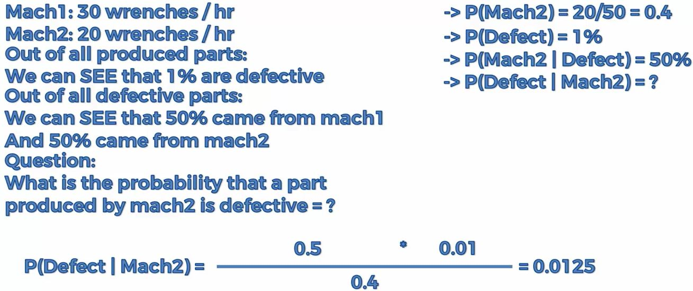
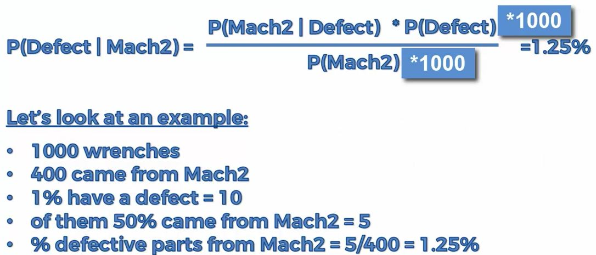

Here is the raw definition:
```{r, out.width = "400px", echo=FALSE}
knitr::include_graphics("../images/bayesTheorem.JPG")
```

The Naive Bayes algorithm is a classification algorithm based on Bayes’ theorems and can be used for both exploratory and predictive modeling. The word naïve in the name Naïve Bayes derives from the fact that the algorithm uses Bayesian techniques but does not take into account dependencies that may exist. 

Bayes is based on probabilities based on some information that we already have.  Will explain using an example on wrenches produced by two machines.

```{r, out.width = "400px", echo=FALSE}


```

It is actually very intuitive.  Here is an example assuming 1000 were manufactured:
```{r, out.width = "300px", echo=FALSE}

```

The requirements for a Naive Bayes model are as follows: 
 
- A single key column Each model must contain one numeric or text column that uniquely identifies each record. Compound keys are not allowed. 
- Input columns In a Naive Bayes model, all columns must be either discrete, or the values must have been binned.  
- Variables must be independent. For a Naive Bayes model, it is also important to ensure that the input attributes are independent of each other. This is particularly important when you use the model for prediction. If you use two columns of data that are already closely related, the effect would be to multiply the influence of those columns, which can obscure other factors that influence the outcome. 
Conversely, the ability of the algorithm to identify correlations among variables is useful when you are exploring a model or dataset, to identify relationships among inputs. 
- At least one predictable column The predictable attribute must contain discrete or discretized values. 
The values of the predictable column can be treated as inputs. This practice can be useful when you are exploring a new dataset, to find relationships among the columns. 

```{r naiveBayes, warning=FALSE, message=FALSE}
# Importing the dataset
dataset = read.csv("../data/Social_Network_Ads.csv")
dataset = dataset[3:5]

# Encoding the target feature as factor
dataset$Purchased = factor(dataset$Purchased, levels = c(0, 1))

# Splitting the dataset into the Training set and Test set
# install.packages('caTools')
library(caTools)
set.seed(123)
split = sample.split(dataset$Purchased, SplitRatio = 0.75)
training_set = subset(dataset, split == TRUE)
test_set = subset(dataset, split == FALSE)

# Feature Scaling
training_set[-3] = scale(training_set[-3])
test_set[-3] = scale(test_set[-3])

# Fitting SVM to the Training set
# install.packages('e1071')
library(e1071)
classifier = naiveBayes(x = training_set[-3], y = training_set$Purchased)

# Predicting the Test set results
y_pred = predict(classifier, newdata = test_set[-3])
y_pred[1:10]

# Making the Confusion Matrix
cm = table(test_set[, 3], y_pred)
cm

# Visualising the Training set results
library(ElemStatLearn)
set = training_set
X1 = seq(min(set[, 1]) - 1, max(set[, 1]) + 1, by = 0.01)
X2 = seq(min(set[, 2]) - 1, max(set[, 2]) + 1, by = 0.01)
grid_set = expand.grid(X1, X2)
colnames(grid_set) = c('Age', 'EstimatedSalary')
y_grid = predict(classifier, newdata = grid_set)
plot(set[, -3],
     main = 'SVM (Training set)',
     xlab = 'Age', ylab = 'Estimated Salary',
     xlim = range(X1), ylim = range(X2))
     contour(X1, X2, matrix(as.numeric(y_grid), length(X1), length(X2)), add = TRUE)
     points(grid_set, pch = '.', col = ifelse(y_grid == 1, 'springgreen3', 'tomato'))
     points(set, pch = 21, bg = ifelse(set[, 3] == 1, 'green4', 'red3'))

# Visualising the Test set results
library(ElemStatLearn)
set = test_set
X1 = seq(min(set[, 1]) - 1, max(set[, 1]) + 1, by = 0.01)
X2 = seq(min(set[, 2]) - 1, max(set[, 2]) + 1, by = 0.01)
grid_set = expand.grid(X1, X2)
colnames(grid_set) = c('Age', 'EstimatedSalary')
y_grid = predict(classifier, newdata = grid_set)
plot(set[, -3], main = 'SVM (Test set)',
     xlab = 'Age', ylab = 'Estimated Salary',
     xlim = range(X1), ylim = range(X2))
     contour(X1, X2, matrix(as.numeric(y_grid), length(X1), length(X2)), add = TRUE)
     points(grid_set, pch = '.', col = ifelse(y_grid == 1, 'springgreen3', 'tomato'))
     points(set, pch = 21, bg = ifelse(set[, 3] == 1, 'green4', 'red3'))
```