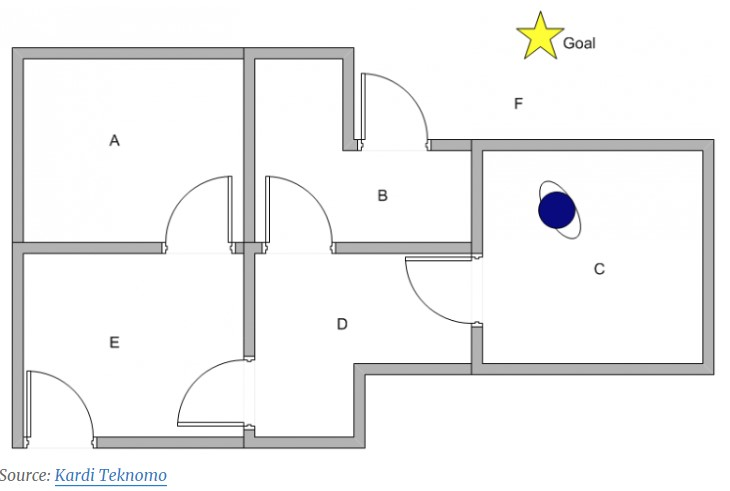

```{r message=FALSE, warning=FALSE, echo=FALSE}
#setwd("~/GitHub/MachineLearning")
if(!require(easypackages)){install.packages("easypackages")}
library(easypackages)
packages("tidyverse", prompt = FALSE)
```

# Introduction

It can be argued that most important decisions in life are some variant of an _exploitation-exploration_ problem. Should I stick with my current job or look for a new one? Shall I continue reading the book or watch the movie instead? In all of those cases the question is always whether I should _exploit_ the thing I have or whether I should _explore_ new things. 

At the core this can be stated as the problem a gambler has who wants to play a one-armed bandit: if there are several machines with different winning probabilities (a so-called multi-armed bandit problem) the question the gambler faces is: which machine to play? He could _exploit_ one machine or _explore_ different machines. So what is the best strategy given a limited amount of time and money?

There are two extreme cases: no exploration, i.e. playing only one randomly chosen bandit, or no exploitation, i.e. playing all bandits randomly – so obviously we need some middle ground between those two extremes. We have to start with one randomly chosen bandit, try different ones after that and compare the results. So in the simplest case the first variable $\epsilon = 0.1$ is the probability rate with which to switch to a random bandit – or to stick with the best bandit found so far.

Let us create an example with $n = 5$ bandits, which return 4 units on average, except the second one which returns 5 units. So the best strategy would obviously be to choose the second bandit right away and stick with it, but of course we don’t know the average returns of each bandit so this won’t work. Instead we need another vector `Q` which tallies the results of each bandit so far. This vector has to be updated after each game, so we need an update function which gets as arguments the current bandit and the return of the game.

The intelligence of the strategy lies in this update function, so how should we go about? The big idea behind this strategy is called __Bellman equation__ and in its simplest form it works as follows: the adjustment of the former result vector is the difference between the former result and the current result weighted by some discount factor, in this case the inverse of the number of games played on the respective machine. This learning strategy is called __Q-learning__ and is a so called __reinforcement learning__ technique.

Have a look at the following example implementation:

```{r}
set.seed(3141) # for reproducibility
 
# Q-learning update function
update <- function(i, r) {
  Q[i] <<- Q[i] + 1/(k[i]+1) * (r-Q[i]) # Q-learning function
  k[i] <<- k[i] + 1 # one more game played on i'th bandit
}
 
# simulate game on one-armed bandit i
ret <- function(i) {
  round(rnorm(1, mean = rets[i]))
}
 
# chose which bandit to play
which.bandit <- function() {
  p <- runif(1)
  ifelse(p >= epsilon, which.max(Q), sample(1:n, 1))
}
```
```{r}
epsilon <- 0.1 # switch in epsilon percent of cases
rets <- c(4, 5, 4, 4, 4) # average returns of bandits
n <- length(rets)
Q <- rep(0, n) # initialize return vector
k <- rep(0, n) # initialize vector for games played on each bandit
N <- 1000 # no. of runs
R <- 0 # sum of returns
 
for (j in 1:N) {
  i <- which.bandit() # chose bandit
  r <- ret(i) # simulate bandit
  R <- R + r # add return of bandit to overall sum of returns
  update(i, r) # calling Q-learning update function
}
 
which.max(Q) # which bandit has the highest return?
```
```{r}
Q
```
```{r}
k
```
```{r}
N * max(rets) # theoretical max. return
```
```{r}
R
```
```{r}
R / (N * max(rets)) # percent reached of theoretical max
```

So, obviously the algorithm found a nearly perfect strategy all on its own!

Now, this is the simplest possible application of reinforcement learning. Let us now implement a more sophisticated example: a robot navigating a maze. Whereas the difficulty in the first example was that the feedback was blurred (because the return of each one-armed bandit is only an average return) here we only get definitive feedback after several steps (when the robot reaches its goal). Because this situation is more complicated we need more memory to store the intermediate results. In our multi-armed bandit example the memory was a vector, here we will need a matrix.

The robot will try to reach the goal in the following maze (i.e. to get out of the maze to reach F which can be done via B or E) and find the best strategy for each room it is placed in:

```{r, out.width = "500px", echo=FALSE}

```

```{r}
# find all possible actions
AllActions <- function(state, R) {
  which(R[state, ] >= 0)
}
 
# chose one action out of all possible actions by chance
PossibleAction <- function(state, R) {
  sample(AllActions(state, R), 1)
}
 
# Q-learning function
UpdateQ <- function(state, Q, R, gamma, goalstate) {
  action <- PossibleAction(state, R)
  Q[state, action] <- R[state, action] + gamma * max(Q[action, AllActions(action, R)]) # Bellman equation (learning rate implicitly = 1)
  if(action != goalstate) Q <- UpdateQ(action, Q, R, gamma, goalstate)
  Q
}
 
# recursive function to get the action with the the maximum Q value
MaxQ <- function(state, Q, goalstate) {
  action <- which.max(Q[state[length(state)], ])
  if (action != goalstate) action <- c(action, MaxQ(action, Q, goalstate))
  action
}
 
# representation of the maze
R <- matrix(c(-Inf, -Inf, -Inf, -Inf,    0, -Inf,
              -Inf, -Inf, -Inf,    0, -Inf,  100,
              -Inf, -Inf, -Inf,    0, -Inf, -Inf,
              -Inf,    0,    0, -Inf,    0, -Inf,
                 0, -Inf, -Inf,    0, -Inf,  100,
              -Inf,    0, -Inf, -Inf,    0,  100), 
            ncol = 6, byrow = TRUE)

colnames(R) <- rownames(R) <- LETTERS[1:6]
R
```
```{r}
Q <- matrix(0, nrow = nrow(R), ncol = ncol(R))
colnames(Q) <- rownames(Q) <- LETTERS[1:6]
Q
```
```{r}
gamma <- 0.8 # learning rate
goalstate <- 6
N <- 50000 # no. of episodes

for (episode in 1:N) {
  state <- sample(1:goalstate, 1)
  Q <- UpdateQ(state, Q, R, gamma, goalstate)
}
 
Q
```
```{r}
Q / max(Q) * 100
```
```{r}
# print all learned routes for all rooms
for (i in 1:goalstate) {
  cat(LETTERS[i], LETTERS[MaxQ(i, Q, goalstate)], sep = " -> ")
  cat("\n")
}
```

So again, the algorithm has found the best route for each room!

Reference:
http://blog.ephorie.de/reinforcement-learning-life-is-a-maze