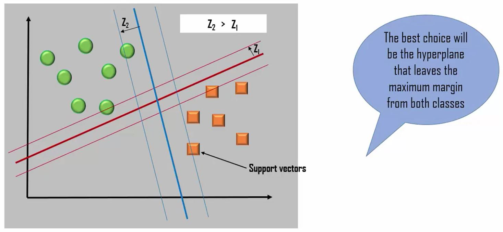

```{r echo=FALSE, warning=FALSE, message=FALSE}
if(!require(easypackages)){install.packages("easypackages")}
library(easypackages)
packages("kernlab", "dplyr", prompt = FALSE)
```

## SVM Introduction

```{r out.width = "500px", echo=FALSE}
knitr::include_graphics("../images/ML2_SVM1.JPG")


```

```{r}
# Read Data
letterdata <- read.csv("../data/letterdata.csv", header=TRUE)
glimpse(letterdata)

#training and test set
letters_train <- letterdata[1:16000, ]
letters_test  <- letterdata[16001:20000, ]

#Training a model on the data
letter_classifier <- ksvm(letter ~ ., data = letters_train, kernel = "vanilladot") 
# We will use vanilla dot for Linear separability 
letter_classifier
 
#Evaluate Model performance
letter_predictions <- predict(letter_classifier, letters_test)
head(letter_predictions)
table(letter_predictions, letters_test$letter)
agreement <- letter_predictions == letters_test$letter
table(agreement)
 
prop.table(table(agreement))
 
#Improve Model Performance
letter_classifier_rbf <- ksvm(letter ~ ., data = letters_train, kernel = "rbfdot")
#Using radial model this time
letter_predictions_rbf <- predict(letter_classifier_rbf, letters_test)
table(letter_predictions_rbf, letters_test$letter)
agreement_rbf <- letter_predictions_rbf == letters_test$letter
table(agreement_rbf)
prop.table(table(agreement_rbf))
```

