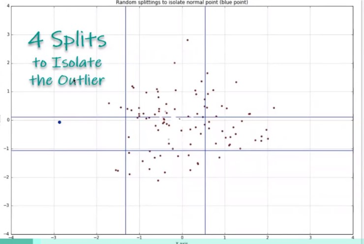

```{r setup, include=FALSE}
knitr::opts_chunk$set(echo = TRUE)
```

# Anomaly  Types

## Point Anomalies

- Unsupervised
      - kNN (nearest neighbors)
      - K-Means
      - Isolation Forest (scalable with H2O)
- Supervised
      - SVM
      - xgboost

## Contexual Time Series
      - anomalize package
      
## Group (Collective)
- Unsupervised
      - kNN
      - K-Means
      - Isolation Forest
- Supervised
      - SVM
      - xgbooost

# Isolation Forest

- Uses random forest algo
- Randomly select one feature (target) - this is what lets it be unsupervised
- Random splits, separation and classifying data

> Key Concept:  Outliers have fewer splits to isolate in the decsion tree

```{r, out.width = "300px", echo=FALSE}

```

# Pro Tips

1. Run algo multiple times and average results
- Isolation Forest randomly selet a single tagrt - if it is a bad one --> bad results
      - run multiple times changing the seed
      - average the results
2. Adjust Quantile/Threshold based on visializing the outliers - use common sense
3. Visualize what is happening


Isolation Forest can be used to classify data (outlier or not).  The ML (xgboost perhaps) can be used as a classification alorithm which in ture could be explained  (LIME, perhaps DALEX)

