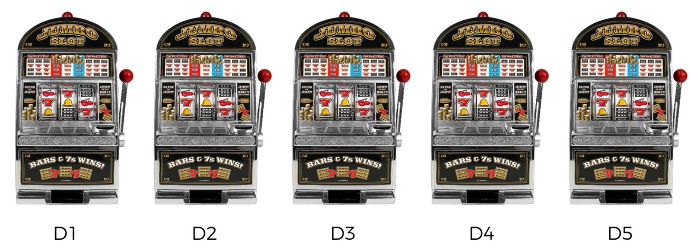
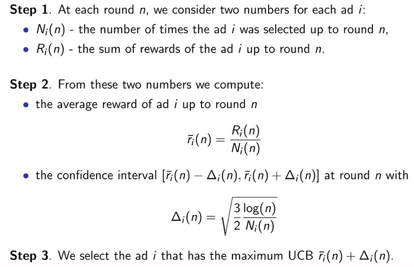
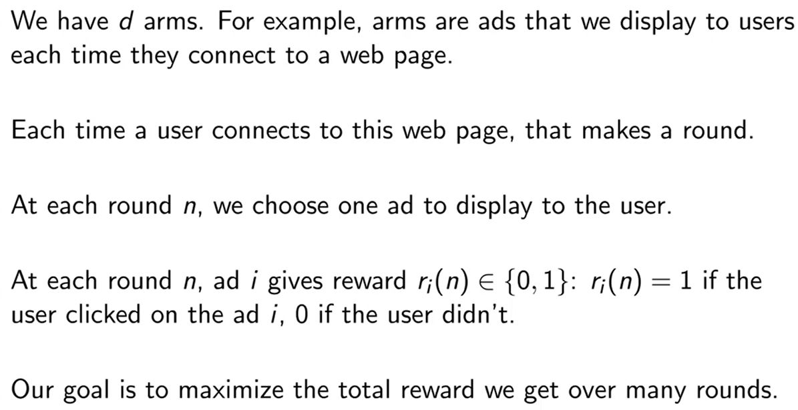
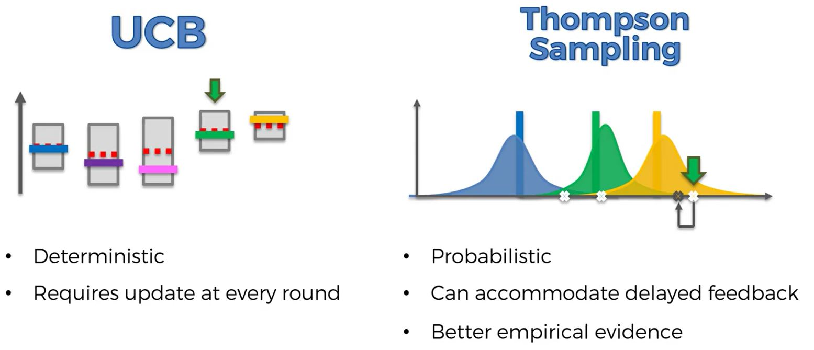

Learn by example (called 1-armed bandit problem)
This allows you to reduce the number of A/B Tests to save money but still identify the best ad.

```{r, out.width = "300px", echo=FALSE}

```

## Upper Confidence Bound

```{r}
dataset = read.csv('./data/Ads_CTR_Optimisation.csv')
head(dataset)
```
The data is a sparse matrix of different ads.  Which will give the best conversion rate?
What is the strategy to determine which will give the best CTR.
Reinforcement Learning will use the previous records to select what ad to show.  (Exploration vs exploitation.)

Lets evaluate the first few records so we understand what is happening.

The first user will click on the ads 1, 5, 9.
The second user will only click on the 9th ad.
The third will not click through for any ad.

The previous observations are used to determine the next ads displays for future users.

Before proceeding with reinforcement learning, lets see what happens if we randomly select ads to display:

```{r}
# Implementing Random Selection
N = 10000
d = 10
ads_selected = integer(0)
total_reward = 0
for (n in 1:N) {
  ad = sample(1:10, 1)
  ads_selected = append(ads_selected, ad)
  reward = dataset[n, ad]
  total_reward = total_reward + reward
}
total_reward
```

```{r}
# Visualizing the results
hist(ads_selected, col = 'blue',
     main = 'Histogram of ads selections', sub = 'Ave total reward ~ 1200',
     xlab = 'Ads', ylab = 'Number of times each ad was selected')
```

Randomly selecting the ads, on average, the total reward is around 1200.  We would expect a nearly uniform distribution since it is randomized.

Now lets see if we do better with reinforcement learning.  Unfortunately, there is no r package with this functionality - at least not yet!.  Therefore, we will build it from scratch.

```{r, out.width = "600px", echo=FALSE}

```

```{r}
# Implementing UCB
N = 10000#number of add tests
d = 10#number of different ads
ads_selected = integer(0)
numbers_of_selections = integer(d)#Step 1
sums_of_rewards = integer(d)#Step 1
total_reward = 0

#Start of Step 2
for (n in 1:N) {
  ad = 0
  max_upper_bound = 0
  
  for (i in 1:d) {
    if (numbers_of_selections[i] > 0) {
      #Below is the average reward calculation
      average_reward = sums_of_rewards[i] / numbers_of_selections[i]
      #Calculate the confidence level
      delta_i = sqrt(3/2 * log(n) / numbers_of_selections[i])
      upper_bound = average_reward + delta_i
    } else {
        upper_bound = 1e400#
    }
    if (upper_bound > max_upper_bound) {
      max_upper_bound = upper_bound
      ad = i
    }
  }
  
  #Add elements to a vector.  append(x, values, after = length(x))
  #A vector containing the values in x with the elements of values appended after the specified element of x.
  ads_selected = append(ads_selected, ad)
  numbers_of_selections[ad] = numbers_of_selections[ad] + 1
  reward = dataset[n, ad]
  sums_of_rewards[ad] = sums_of_rewards[ad] + reward
  total_reward = total_reward + reward
}
total_reward
```
Note that the total rewards is nearly double the random total rewards!

Lets look at the ads selected:

```{r}
ads_selected[1:40]
```

Notice that the first 10 ads were just assigned 1 through 10.  After this, the algorithm kicks in and starts learning.

To know what ad is best (best CTR, highest conversion rate), just look at the end of the ads_selected vector:

```{r}
ads_selected[(N-40):N]
```

Ad 5 appears to be the winner!
```{r}
# Visualizing the results
hist(ads_selected,
     col = 'blue',
     main = 'Histogram of ads selections',
     xlab = 'Ads',
     ylab = 'Number of times each ad was selected')
```

## Thompson Sampling Algorithm

A probabilistic algorithm.

One notable difference is the Thompson Sampling Algorithm uses distributions compared to the Upper Confidence Bound that uses confidence intervals that converges to expected value.

Here is the process that we will develop an R solution for the Thompson Sampling Algorithm.

```{r out.width = "600px", echo=FALSE}

```

##Compare UCB and Thompson Sampling Algorithm

```{r out.width = "600px", echo=FALSE}

```

Major advantage with Thompson Sampling is updates can be batched - useful in web testing so each individual click does not need to be immediately processed - too computationally expensive.

```{r}
# Importing the dataset
dataset = read.csv('./data/Ads_CTR_Optimisation.csv')

# Implementing Thompson Sampling
N = 10000
d = 10
ads_selected = integer(0)
numbers_of_rewards_1 = integer(d)#initializes a vector of 10 0's
numbers_of_rewards_0 = integer(d)#initializes a vector of 10 0's
total_reward = 0

for (n in 1:N) {
  ad = 0
  max_random = 0
  
  #rbeta:  Density, distribution function, quantile function and random generation for the Beta distribution 
  #with parameters shape1 and shape2 
  for (i in 1:d) {
    random_beta = rbeta(n = 1,
                        shape1 = numbers_of_rewards_1[i] + 1,
                        shape2 = numbers_of_rewards_0[i] + 1)
    if (random_beta > max_random) {
      max_random = random_beta
      ad = i
    }
  }
  
  ads_selected = append(ads_selected, ad)
  reward = dataset[n, ad]
  
  if (reward == 1) {numbers_of_rewards_1[ad] = numbers_of_rewards_1[ad] + 1} 
     else {numbers_of_rewards_0[ad] = numbers_of_rewards_0[ad] + 1}
  
  total_reward = total_reward + reward
}
total_reward
```

Recall a random selection gave an average reward of ~1200, Upper Confidence Bound produced a total reward of 2178.

Thompson Sampling Algorithm gives ~2578.  (There is some randomization in this, the total reward varies.)

```{r}
# Visualizing the results
hist(ads_selected,
     col = 'blue',
     main = 'Histogram of ads selections',
     xlab = 'Ads',
     ylab = 'Number of times each ad was selected')
```

Again, ad 5 is most selected.  Appears even more popular than in the plot for UCB.