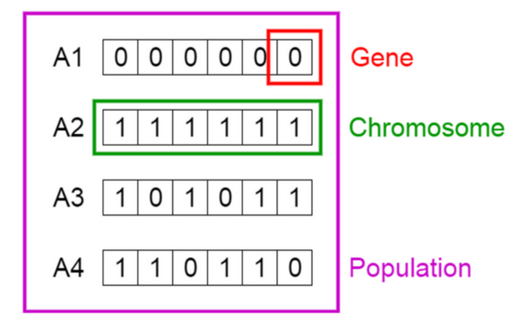
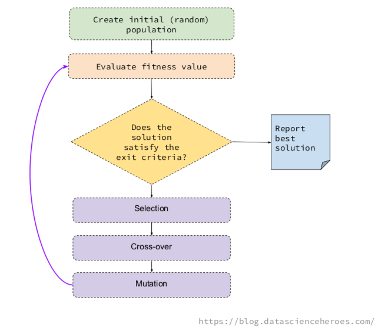

<style type="text/css">
p{ /* Normal  */
   font-size: 14px;
   line-height: 18px;}
body{ /* Normal  */
   font-size: 14px;}
td {  /* Table  */
   font-size: 12px;}
h1 { /* Header 1 */
 font-size: 26px;
 color: #4294ce;}
h2 { /* Header 2 */
 font-size: 22px;}
h3 { /* Header 3 */
 font-size: 18px;}
code.r{ /* Code block */
  font-size: 12px;}
pre { /* Code block */
  font-size: 12px}
#table-of-contents h2 {
  background-color: #4294ce;}
#table-of-contents{
  background: #688FAD;}
#nav-top span.glyphicon{
  color: #4294ce;}
#postamble{
  background: #4294ce;
  border-top: ;}
</style>

```{r echo=FALSE, warning=F, message=F}
if(!require(easypackages)){install.packages("easypackages")}
library(easypackages)
packages("caret", "randomForest", "funModeling", "tidyverse", "GA", prompt = TRUE)
options(digits = 3)

setwd("~/GitHub/MachineLearning/PreProcessing")
```

# Introduction

__What are genetic algorithms?__: Genetic Algortithms (GA) are a mathematical model inspired by the famous Charles Darwin's idea of natural selection. 
The natural selection preserves only the fittest individuals, over the different generations.

Imagine a population of 100 rabbits in 1900, if we look the population today, we are going to others rabbits more fast and skillful to find food than their ancestors.

__GA in ML__: In machine learning, one of the uses of genetic algorithms is to pick up the right number of variables in order to create a predictive model.  To pick up the right subset of variables is a problem of combinatory and optimization.

The advantage of this technique over others is, it allows the best solution to emerge from the best of prior solutions. An evolutionary algorithm which improves the selection over time.

The idea of GA is to combine the different solutions generation after generation to extract the best genes (variables) from each one. That way it creates new and more fitted individuals.

We can find other uses of GA such as hyper-tunning parameter, find the maximum (or min) of a function or the search for a correct neural network arquitecture (Neuroevolution), or among others...

__GA in feature selection__: Every possible solution of the GA, which are the selected variables, are considered as a whole, it will not rank variables individually against the target. And this is important because we already know that variables work in group.

__What does a solution look like?__: Keeping it simple for the example, imagine we have a total of 6 variables, One solution can be picking up 3 variables, let's say: var2, var4 and var5. Another solution can be: var1 and var5. These solutions are the so-called individuals or chromosomes in a population. They are possible solutions to our problem.

```{r, out.width = "300px", echo=FALSE}

```

From the image, solution 3 can be expressed as a one-hot vector: c(1,0,1,0,1,1). Each 1 indicates the solution containg that variable. In this case: var1, var3, var5, var6.

While the solution 4 is: c(1,1,0,1,1,0). Each position in the vector is a gene.

```{r, out.width = "300px", echo=FALSE}

```

The underlying idea of a GA is to generate some random possible solutions (called population), which represent different variables, to then combine the best solutions in an iterative process.

This combination follows the basic GA operations, which are: selection, mutation and cross-over.

- __Selection__: Pick up the most fitted individuals in a generation (i.e.: the solutions providing the highest ROC).
- __Cross-over__: Create 2 new individuals, based on the genes of two solutions. These children will appear to the next generation.
- __Mutation__: Change a gene randomly in the individual (i.e.: flip a 0 to 1)

The idea is for each generation, we will find better individuals, like a fast rabbit.

These basic operations allow the algorithm to change the possible solutions by combining them in a way that maximizes the objective.

# The fitness function

This objective maximization is, for example, to keep with the solution that maximizes the area under the ROC curve. This is defined in the fitness function. The fitness function takes a possible solution (or chromosome, if you want to sound more sophisticated), and somehow evaluates the effectiveness of the selection.

Normally, the fitness function takes the one-hot vector c(1,1,0,0,0,0), creates, for example, a random forest model with var1 and var2, and returns the fitness value (ROC).

The fitness value in this code calculates is: ROC value / number of variables. By doing this the algorithm penalizes the solutions with a large number of variables. Similar to the idea of Akaike information criterion, or AIC.

# Genetics Algorithms in R!

My intention is to provide you with a clean code so you can understand what's behind, while at the same time, try new approaches like modifying the fitness function. This is a crucial point.

To use on your own data set, make sure `data_x` (data frame) and `data_y` (factor) are compatible with the `custom_fitness` function.

The main library is `GA`, developed by Luca Scrucca. See here the [vignette](https://cran.r-project.org/web/packages/GA/vignettes/GA.html) with examples.

_The code is ready to calculate the best subset for a cancer dataset (`data_breast_cancer2.csv`). This is in `var_sel_gen_alg.R`.

The initial data preparation removes the NA, and it converts the target variable (`data_y`) into a factor in order to create the predictive model. Both are conditions for the Random Forest that is built behind, using `caret`.

You can find how the predictive model is created in the function `get_roc_metric`, inside the `lib_ga.R` file. And it is, as the name suggests, prepared for a binary classification problem.

My suggestion before applying with your data is, use the function `get_roc_metric` directly with your current dataset, and see if it ends ok. If so, proceed to apply the GA procedure.

My idea was to encapsulate the fitness function so you can adjust it better for your purposes. For example, if you want to return Kappa statistic (multi-class target), or RMSE (regression-target). You have to replace `get_roc_metric` function.
_
```{r}
####################################################################
## Script to select best variables for a classification mode using genetic algorithms. 
## Based on `GA` library with custom fitness function. 
## This script is explained in the post: 
## Contact: https://twitter.com/pabloc_ds
####################################################################

source("./source/lib_ga.R")

data=read_delim("./data/data_breast_cancer2.csv", delim = ",")  

# Data preparation
data2=na.omit(data) # <- use with care...

data_y=as.factor(data2$diagnosis)
data_x=select(data2, -diagnosis, -id)

# GA parameters
param_nBits=ncol(data_x)
col_names=colnames(data_x)

# Executing the GA 
ga_GA_1 = ga(fitness = function(vars) custom_fitness(vars = vars, 
                                                     data_x =  data_x, 
                                                     data_y = data_y, 
                                                     p_sampling = 0.7), # custom fitness function
             type = "binary", # optimization data type
             crossover=gabin_uCrossover,  # cross-over method
             elitism = 3, # number of best ind. to pass to next iteration
             pmutation = 0.03, # mutation rate prob
             popSize = 50, # the number of indivduals/solutions
             nBits = param_nBits, # total number of variables
             names=col_names, # variable name
             run=5, # max iter without improvement (stopping criteria)
             maxiter = 50, # total runs or generations
             monitor=plot, # plot the result at each iteration
             keepBest = TRUE, # keep the best solution at the end
             parallel = T, # allow parallel procesing
             seed=84211 # for reproducibility purposes
)


# Checking the results
summary(ga_GA_1)
```

```{r}
# Following line will return the variable names of the final and best solution
best_vars_ga=col_names[ga_GA_1@solution[1,]==1]

# Checking the variables of the best solution...
best_vars_ga
```

```{r}
# Checking the accuracy
get_accuracy_metric(data_tr_sample = data_x, target = data_y, best_vars_ga)
```

# Reference

https://github.com/pablo14/genetic-algorithm-feature-selection
https://blog.datascienceheroes.com/feature-selection-using-genetic-algorithms-in-r/

