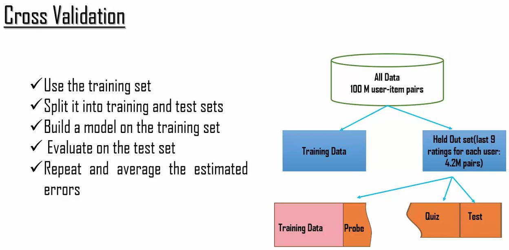
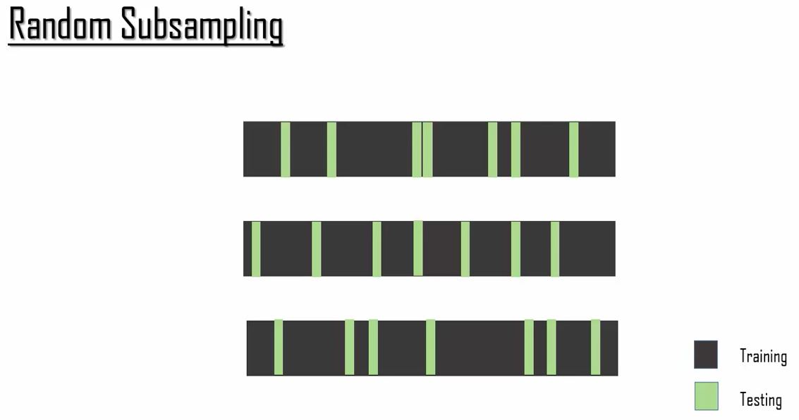
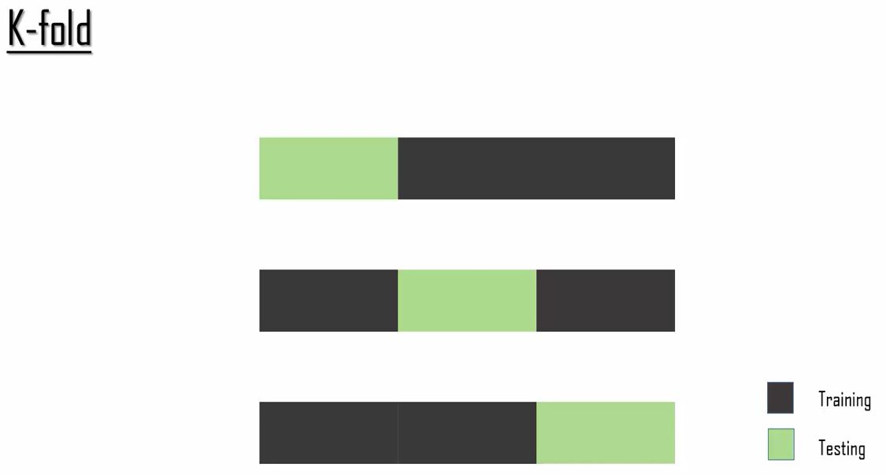
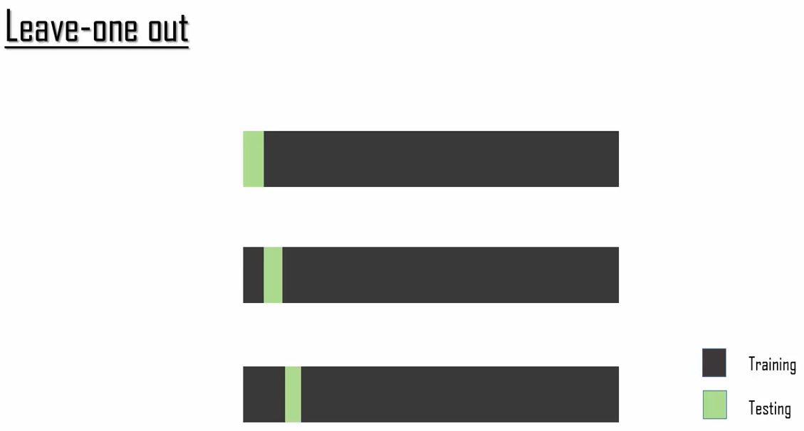
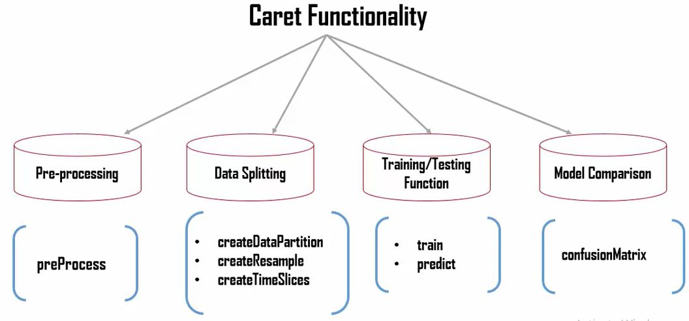

```{r out.width = "500px", echo=FALSE}

```

Datasets:

- Train Data is used to train the model.  It contains a set of data that has plreclassified target and predictor variables.
- Test Data is used to evalaute how well the model does with data outside the trainnig set
- Validation data is used to evalaute the adjusted model and its results compared to unused preclassified data.

Methods of Cross Validation

- Random Subsampling

```{r out.width = "600px", echo=FALSE}

```

- k-Fold Cross Validation

```{r out.width = "500px", echo=FALSE}

```

- Leave One Out

```{r out.width = "500px", echo=FALSE}

```

- Caret Package

```{r out.width = "500px", echo=FALSE}

```

```{r echo=FALSE, warning=FALSE, message=FALSE}
if(!require(easypackages)){install.packages("easypackages")}
library(easypackages)
packages("caret", "kernlab", "dplyr", prompt = FALSE)#kernlab needed for spam data
```

```{r message=FALSE, warning=FALSE}
data(spam)
glimpse(spam)

 # I will partition the data of the spam type in whch I will take 75 % percent data for training
 # and 25 % percent data for testing
inTrain<-createDataPartition(y = spam$type, p=0.75,list=FALSE)#provides a random matrix of 3451 values of 4601 (75%)

training <- spam[inTrain,]
glimpse(training)
dim(training)
testing<-spam[-inTrain,]
glimpse(testing)
dim(testing)

# Fit a model
set.seed(32343)
modelFit<-train(type~., data = training, methods = "glm")#takes a while to process glm - logistic regression
modelFit

# Prediction the testing sample
predictions<-predict(modelFit,newdata=testing)
head(predictions, 20)

# Confusion Matrix
confusionMatrix(predictions,testing$type)
```
